# Agent-X Architecture Documentation

**Version:** 1.1
**Last Updated:** 2026-02-27
**Platform:** Windows 10/11 (x64, x86, ARM64)
**Runtime:** .NET 8.0 / WinUI 3 (Windows App SDK 1.6)

---

## Table of Contents

1. [Executive Summary](#1-executive-summary)
2. [Solution Structure](#2-solution-structure)
3. [High-Level System Architecture](#3-high-level-system-architecture)
4. [Architectural Patterns and Design Principles](#4-architectural-patterns-and-design-principles)
5. [Presentation Layer (AgentX.App)](#5-presentation-layer-agentxapp)
   - 5.1 [Application Bootstrap and DI Host](#51-application-bootstrap-and-di-host)
   - 5.2 [MainWindow and Navigation Shell](#52-mainwindow-and-navigation-shell)
   - 5.3 [MVVM Implementation](#53-mvvm-implementation)
   - 5.4 [Custom Controls](#54-custom-controls)
   - 5.5 [Value Converters](#55-value-converters)
   - 5.6 [XAML Resource Dictionaries and Theming](#56-xaml-resource-dictionaries-and-theming)
   - 5.7 [Keyboard Shortcut Service](#57-keyboard-shortcut-service)
6. [Service Layer (AgentX.Core)](#6-service-layer-agentxcore)
   - 6.1 [AI Provider Architecture](#61-ai-provider-architecture)
   - 6.2 [Chat Services](#62-chat-services)
   - 6.3 [Document Processing Pipeline](#63-document-processing-pipeline)
   - 6.4 [Indexing Pipeline](#64-indexing-pipeline)
   - 6.5 [Search and RAG Pipeline](#65-search-and-rag-pipeline)
   - 6.6 [Intelligence Services](#66-intelligence-services)
   - 6.7 [Collections and Tagging](#67-collections-and-tagging)
   - 6.8 [Settings and License Services](#68-settings-and-license-services)
7. [Data Layer (AgentX.Core/Data)](#7-data-layer-agentxcoredata)
   - 7.1 [Entity Framework Core Database Context](#71-entity-framework-core-database-context)
   - 7.2 [Entity Relationship Model](#72-entity-relationship-model)
   - 7.3 [Vector Store Implementation](#73-vector-store-implementation)
8. [Key Data Flows](#8-key-data-flows)
   - 8.1 [Document Import Flow](#81-document-import-flow)
   - 8.2 [Chat and Streaming Flow](#82-chat-and-streaming-flow)
   - 8.3 [RAG (Ask Files) Flow](#83-rag-ask-files-flow)
   - 8.4 [Search Mode Routing and Hybrid Search](#84-search-mode-routing-and-hybrid-search)
   - 8.5 [Knowledge Graph Construction Flow](#85-knowledge-graph-construction-flow)
9. [Navigation Architecture](#9-navigation-architecture)
10. [Dependency Injection Configuration](#10-dependency-injection-configuration)
11. [Storage Architecture](#11-storage-architecture)
12. [Startup Sequence](#12-startup-sequence)
13. [Error Handling and Resilience](#13-error-handling-and-resilience)
14. [License Tiers and Feature Gating](#14-license-tiers-and-feature-gating)
15. [Testing Architecture](#15-testing-architecture)
16. [Deployment and Distribution](#16-deployment-and-distribution)
17. [Performance Characteristics](#17-performance-characteristics)
18. [Security Model](#18-security-model)
19. [Glossary](#19-glossary)

---

## 1. Executive Summary

Agent-X is a Windows desktop application built with WinUI 3 and .NET 8 that functions as a personal AI intelligence hub. It allows users to import documents into a local knowledge vault, conduct AI-assisted conversations with multiple provider backends, and perform hybrid semantic and keyword search across their document library using Retrieval-Augmented Generation (RAG).

The application is architected as a clean, three-layer system:

- **Presentation Layer** (`AgentX.App`): A WinUI 3 application hosting 16 pages across a NavigationView shell, with 13 ViewModels following the MVVM pattern using `CommunityToolkit.Mvvm`.
- **Service Layer** (`AgentX.Core`): A .NET 8 class library containing all business logic — AI provider orchestration, document processing, vector search, RAG, conversation memory, knowledge graph, and intelligence services.
- **Data Layer** (`AgentX.Core/Data`): SQLite via Entity Framework Core with 16 entity types, plus a pure-C# vector similarity store writing embeddings as BLOBs to the same SQLite database file.

The architecture enforces a strict unidirectional dependency: `AgentX.App` depends on `AgentX.Core`; `AgentX.Core` has no reference to the presentation layer. All cross-cutting concerns (logging, settings, error handling) flow through injected interfaces. All services are registered as singletons and all views and view models are registered as transients within a `Microsoft.Extensions.Hosting` DI container.

The system is entirely local-first: AI inference runs through Ollama by default, all document storage and embeddings remain on the user's machine, and no telemetry or cloud persistence is required for basic operation. Optional cloud providers (OpenAI, Anthropic) are available when API keys are configured.

---

## 2. Solution Structure

```
Agent-X/
├── AgentX.sln                          # Solution file
├── Directory.Build.props               # Shared MSBuild properties
├── src/
│   ├── AgentX.App/                     # WinUI 3 Presentation Layer
│   │   ├── App.xaml / App.xaml.cs      # Application entry point and DI host
│   │   ├── MainWindow.xaml/.cs         # Navigation shell, status bar, shortcuts
│   │   ├── Views/                      # 16 XAML pages with code-behind
│   │   ├── ViewModels/                 # 13 ViewModels (CommunityToolkit.Mvvm)
│   │   ├── Controls/                   # CommandPalette, MarkdownMessageControl
│   │   ├── Converters/                 # 12 IValueConverter implementations
│   │   ├── Helpers/                    # UI utility helpers
│   │   ├── Services/                   # KeyboardShortcutService (UI layer only)
│   │   ├── Styles/                     # 6 XAML Resource Dictionaries
│   │   └── Assets/                     # Images and application icons
│   └── AgentX.Core/                    # .NET 8 Class Library (Service + Data Layer)
│       ├── AI/                         # AI service, providers, embeddings, cost tracking
│       │   ├── Providers/              # OllamaProvider, OpenAiProvider, AnthropicProvider
│       │   └── Models/                 # AiModel, ChatMessage, ChatOptions, CostTracker
│       ├── Data/                       # EF Core DbContext, entities, migrations, vector DB
│       │   ├── Entities/               # 16 entity classes
│       │   ├── Migrations/             # EF Core migration history
│       │   └── VectorDb/               # SqliteVecStore, IVectorStore, VectorSearchResult
│       ├── Documents/                  # Document import, chunking, processors
│       │   ├── Processors/             # PDF, DOCX, TXT, MD, Code, Image
│       │   └── Models/                 # ProcessedDocument, DocumentMetadata, TextChunk
│       ├── Search/                     # Semantic, keyword, hybrid search, RAG, citations
│       │   └── Models/                 # SearchQuery, SearchResult, SearchMode, RagResponse
│       ├── Helpers/                    # HashHelper and shared utilities
│       └── Services/                   # Domain service groupings
│           ├── Chat/                   # ChatService, ConversationService, MemoryService
│           ├── Collections/            # CollectionService
│           ├── Indexing/               # IndexingService, IndexingQueueService, FileWatcherService
│           ├── Intelligence/           # Summary, Duplicate, OrganizationSuggestion,
│           │                           #   KnowledgeGraph, Digest
│           ├── License/                # LicenseService, LicenseTier, LicenseInfo
│           ├── Settings/               # SettingsService, AppSettings
│           └── Tagging/                # AutoTagService
├── tests/
│   └── AgentX.Tests/                  # xUnit test project
│       ├── AI/                        # AI service and provider tests
│       ├── Data/                      # VectorStore tests
│       ├── Documents/                 # Chunking and processor tests
│       ├── Helpers/                   # HashHelper tests
│       ├── Search/                    # Search pipeline tests
│       └── Services/                  # Chat, indexing, and intelligence tests
├── installer/
│   └── AgentX.iss                     # Inno Setup installation script
├── publish/
│   └── win-x64/                       # Self-contained published binaries
└── docs/                              # This documentation
```

**Dependency Direction (enforced at project reference level):**

```
AgentX.App  ──depends on──>  AgentX.Core  ──depends on──>  (NuGet packages only)
AgentX.Tests ──depends on──> AgentX.Core
```

`AgentX.App` never appears as a dependency of `AgentX.Core`. This boundary is a hard architectural constraint that keeps business logic fully testable and framework-agnostic.

---

## 3. High-Level System Architecture

```mermaid
graph TB
    subgraph Presentation["AgentX.App — Presentation Layer (WinUI 3)"]
        direction TB
        NAV[NavigationView Shell<br/>MainWindow.xaml.cs]
        VIEWS[16 Pages / Views<br/>XAML + Code-Behind]
        VMS[13 ViewModels<br/>CommunityToolkit.Mvvm]
        CTRL[Custom Controls<br/>CommandPalette · MarkdownMessageControl]
        CONV[12 Value Converters]
        KBS[KeyboardShortcutService]
        STYLES[XAML Resource Dictionaries<br/>Colors · Typography · Controls<br/>Navigation · Chat · Documents]

        NAV --> VIEWS
        VIEWS --> VMS
        VIEWS --> CTRL
        VMS --> CONV
        KBS --> NAV
    end

    subgraph Core["AgentX.Core — Service + Data Layer (.NET 8)"]
        direction TB
        subgraph AI["AI Services"]
            AIS[AiService<br/>Provider Orchestrator]
            OLL[OllamaProvider<br/>OllamaSharp]
            OAI[OpenAiProvider<br/>Raw HttpClient SSE]
            ANT[AnthropicProvider<br/>Raw HttpClient SSE]
            EMB[EmbeddingService<br/>all-minilm · 384 dims]
            CTX[ContextWindowManager]
            COST[CostTracker]
            MM[ModelManager]
        end

        subgraph CHAT["Chat Services"]
            CS[ChatService]
            CVS[ConversationService]
            SPS[SystemPromptService]
            MEM[ConversationMemoryService]
        end

        subgraph DOC["Document Pipeline"]
            DS[DocumentService]
            PROC[IDocumentProcessor<br/>PDF · DOCX · TXT · MD · Code · Image]
            CHK[ChunkingService]
            IDX[IndexingService<br/>Channel-based queue]
            FW[FileWatcherService]
        end

        subgraph SEARCH["Search & RAG"]
            SEM[SemanticSearchService]
            KWD[KeywordSearchService<br/>FTS5 BM25]
            HYB[HybridSearchOrchestrator<br/>RRF k=60]
            RAG[RagPipeline]
            CIT[CitationService]
            RRK[RagReranker]
        end

        subgraph INTEL["Intelligence Services"]
            SUM[SummaryService]
            DUP[DuplicateDetectionService]
            ORG[OrganizationSuggestionService]
            KG[KnowledgeGraphService]
            DIG[DigestService]
        end

        subgraph INFRA["Infrastructure"]
            SETT[SettingsService]
            LIC[LicenseService]
            COL[CollectionService]
            TAG[AutoTagService]
        end

        subgraph DATA["Data Layer"]
            DB[AgentXDbContext<br/>EF Core · SQLite]
            VEC[SqliteVecStore<br/>Cosine Similarity BLOB store]
            ENT[16 Entity Types]
        end

        AIS --> OLL
        AIS --> OAI
        AIS --> ANT
        CS --> AIS
        CS --> CVS
        CS --> MEM
        DS --> PROC
        DS --> DB
        IDX --> CHK
        IDX --> EMB
        IDX --> VEC
        IDX --> KWD
        IDX --> TAG
        EMB --> AIS
        SEM --> VEC
        SEM --> EMB
        HYB --> SEM
        HYB --> KWD
        RAG --> SEM
        RAG --> AIS
        RAG --> CIT
        RAG --> RRK
        KG --> DB
        DIG --> DB
        SUM --> AIS
        TAG --> AIS
        DB --> ENT
        VEC -.->|same agentx.db file| DB
    end

    VMS -->|interfaces| AIS
    VMS -->|interfaces| CS
    VMS -->|interfaces| DS
    VMS -->|interfaces| HYB
    VMS -->|interfaces| RAG
    VMS -->|interfaces| KG
    VMS -->|interfaces| DIG
    VMS -->|interfaces| SETT
    VMS -->|interfaces| LIC

    subgraph STORAGE["Local Storage (AppData/AgentX/)"]
        SQLFILE[(agentx.db<br/>SQLite + vec_embeddings)]
        LOGFILE[(Logs/agentx-DATE.log<br/>Serilog rolling · 7 days)]
        SETTFILE[(settings.json<br/>AppSettings)]
    end

    DB --> SQLFILE
    VEC --> SQLFILE
    SETT --> SETTFILE

    subgraph EXTERNAL["External AI Backends"]
        OLLAMASRV[Ollama Server<br/>localhost:11434]
        OPENAISRV[OpenAI API<br/>api.openai.com]
        ANTHSRV[Anthropic API<br/>api.anthropic.com]
    end

    OLL --> OLLAMASRV
    OAI --> OPENAISRV
    ANT --> ANTHSRV
```

---

## 4. Architectural Patterns and Design Principles

### 4.1 MVVM (Model-View-ViewModel)

The entire presentation layer follows strict MVVM. Each page has a corresponding ViewModel. ViewModels are resolved from the DI container via `App.GetService<TViewModel>()` in page constructors. The `CommunityToolkit.Mvvm` source generator is used throughout:

- `[ObservableProperty]` generates `INotifyPropertyChanged` boilerplate for bindable properties.
- `[RelayCommand]` generates `ICommand` implementations for button bindings, with built-in async support and cancellation.
- `ObservableCollection<T>` is used for list bindings that need to reflect real-time updates (message lists, document lists, search results).

Pages that require platform-specific operations (file/folder pickers, drag-and-drop, HWND access) implement this logic in code-behind rather than ViewModels, keeping ViewModels free of WinUI 3 API dependencies and testable in isolation.

### 4.2 Interface-Based Service Contracts

Every service in `AgentX.Core` exposes a public interface (e.g., `IAiService`, `IDocumentService`, `IChatService`). ViewModels depend exclusively on these interfaces, never on concrete implementations. This enables:

- Substitution of implementations without changing consumers.
- Unit testing with mock/stub implementations.
- Future provider additions (new AI backends, new storage engines) without modifying existing code.

### 4.3 Singleton Services, Transient Views and ViewModels

The DI container lifetime strategy is deliberate:

| Registration | Lifetime | Reason |
|---|---|---|
| All Core Services | Singleton | Services are stateful (DB connection, AI provider, indexing queue) and expensive to construct. Sharing a single instance across the app avoids redundant initialization. |
| `AgentXDbContext` | Singleton | A single long-lived EF Core context avoids connection pool overhead. SQLite WAL mode supports concurrent access. |
| `SqliteVecStore` | Singleton | Maintains a persistent `SqliteConnection` for the vec_embeddings table. Must not be recreated. |
| Views and ViewModels | Transient | New instances are created on each navigation, ensuring clean state. The `Frame` caches page instances at the WinUI 3 level, so navigation back does not necessarily trigger reconstruction unless the page was evicted. |

### 4.4 Fire-and-Forget Startup Initialization

Three initialization tasks run as `async void` fire-and-forget during `App.OnLaunched`:

1. `EnsureCreatedAsync()` — creates the SQLite schema if not present.
2. `InitializeFtsAsync()` — creates the FTS5 virtual table for keyword search.
3. `IAiService.InitializeAsync()` — registers providers, tests Ollama connectivity.

This pattern allows the window to appear immediately while initialization continues in the background. Background errors are logged but do not crash the application, which falls back to an offline/disconnected state gracefully.

### 4.5 Channel-Based Background Queue

The `IndexingService` uses `System.Threading.Channels.Channel<long>` as an unbounded, single-reader queue. Document IDs are written to the channel from any thread when a new import is accepted. A single background `Task` reads from the channel serially, ensuring that embedding generation — which calls a local AI model — is never parallelized in a way that would saturate memory or the inference backend.

---

## 5. Presentation Layer (AgentX.App)

### 5.1 Application Bootstrap and DI Host

`App.xaml.cs` is the application entry point. It creates a `Microsoft.Extensions.Hosting.IHost` in `OnLaunched` using the generic host builder:

```csharp
_host = Microsoft.Extensions.Hosting.Host.CreateDefaultBuilder()
    .UseSerilog()
    .ConfigureServices(ConfigureServices)
    .Build();
```

**Relevant file:** `src/AgentX.App/App.xaml.cs`

The static `App.GetService<T>()` method provides a service locator pattern as a pragmatic concession to WinUI 3's lack of DI-aware frame navigation. Views that need services call `App.GetService<T>()` in their constructors or code-behind, then inject them into ViewModel constructors at construction time.

Logging is configured using Serilog with two sinks:
- `Debug` sink for Visual Studio Output window during development.
- `File` sink with daily rolling interval and a 7-day retention window, writing to `%LocalAppData%/AgentX/Logs/agentx-{date}.log`.

Global exception handling is wired to three events:
- `AppDomain.CurrentDomain.UnhandledException` — for non-UI thread exceptions.
- `TaskScheduler.UnobservedTaskException` — for unobserved `Task` failures.
- `Application.UnhandledException` — for WinUI 3 UI thread exceptions (marked `Handled = true` to prevent crash).

### 5.2 MainWindow and Navigation Shell

`MainWindow.xaml.cs` owns the application chrome and all navigation state.

**Window configuration:**
- Initial size: 1440 x 900, centered on the primary display.
- Backdrop: Mica Alt (`MicaKind.BaseAlt`) on Windows 11 22H2+, falling back to Desktop Acrylic on older Windows 11, then solid fallback.
- Title bar: Extended into content area with custom dark-theme button colors (transparent background, semi-transparent foreground, subtle white hover).

**Navigation model:**

```csharp
private readonly Dictionary<string, Type> _pageMap = new()
{
    ["Dashboard"]       = typeof(Views.DashboardPage),
    ["Digest"]          = typeof(Views.DigestPage),
    ["Chat"]            = typeof(Views.ChatPage),
    ["AskFiles"]        = typeof(Views.AskFilesPage),
    ["QuickActions"]    = typeof(Views.QuickActionsPage),
    ["KnowledgeVault"]  = typeof(Views.KnowledgeVaultPage),
    ["Collections"]     = typeof(Views.CollectionManagerPage),
    ["Search"]          = typeof(Views.SearchPage),
    ["KnowledgeGraph"]  = typeof(Views.KnowledgeGraphPage),
    ["ModelManager"]    = typeof(Views.ModelManagerPage),
    ["HardwareAdvisor"] = typeof(Views.HardwareAdvisorPage),
    ["Settings"]        = typeof(Views.SettingsPage),
    // plus UserGuide, PrivacyPolicy, TermsOfService
};
```

Navigation is driven by `NavigationView.SelectionChanged`, which reads the `Tag` property of the selected `NavigationViewItem` and looks up the corresponding `Type` in `_pageMap`. A parallel `_navItemMap` keeps the `NavigationViewItem` references so that programmatic navigation (from keyboard shortcuts or the command palette) can synchronize the NavigationView selection indicator with the `Frame`.

**Status bar:** A `DispatcherTimer` polls every 30 seconds (after a 5-second initial delay) to update three status indicators: AI connection dot + model name, indexing progress ring + queue count, and total document count.

**Onboarding override:** On first run (`settings.OnboardingCompleted == false`), the NavigationView pane is hidden and the Frame navigates to `OnboardingPage`. A `_suppressNavigation` flag prevents `SelectionChanged` from re-navigating away during setup. `CompleteOnboarding()` is a public method called by `OnboardingViewModel` when the wizard finishes.

**Relevant files:**
- `src/AgentX.App/MainWindow.xaml`
- `src/AgentX.App/MainWindow.xaml.cs`

### 5.3 MVVM Implementation

The 13 ViewModels correspond to the navigable pages (all pages except `UserGuidePage`, `PrivacyPolicyPage`, and `TermsOfServicePage`, which are static content and do not need ViewModels):

| ViewModel | Primary Responsibilities |
|---|---|
| `DashboardViewModel` | Aggregate stats: doc count, conversation count, recent activity |
| `ChatViewModel` | Conversation management, streaming token display, suggested questions |
| `AskFilesViewModel` | RAG queries against the Knowledge Vault, citation display |
| `KnowledgeVaultViewModel` | Document list, import, delete, reindex, bulk operations |
| `CollectionManagerViewModel` | Collection CRUD, document assignment |
| `SearchViewModel` | Hybrid/semantic/keyword search, result display, search history |
| `KnowledgeGraphViewModel` | Graph data loading, Canvas-based force-directed rendering |
| `ModelManagerViewModel` | Ollama model list, pull, delete, active model selection |
| `HardwareAdvisorViewModel` | Hardware detection, model recommendations |
| `QuickActionsViewModel` | AI summarize, auto-tag, duplicate scan on selected documents |
| `DigestViewModel` | Weekly digest report generation and display |
| `SettingsViewModel` | Settings read/write, provider switching, test connection |
| `OnboardingViewModel` | Multi-step wizard state, provider setup, completion callback |

### 5.4 Custom Controls

**`CommandPalette`** (`Controls/CommandPalette.xaml.cs`)

A keyboard-activated overlay (Ctrl+K) providing fuzzy search across all navigable pages and registered actions. It exposes two callback delegates injected by `MainWindow`:

```csharp
public Action<string>? NavigateToPageRequested { get; set; }
public Action<string>? ExecuteActionRequested { get; set; }
```

Actions include: `NewConversation`, `ImportFiles`, `RefreshDashboard`, `ToggleTheme`. Pressing Escape while the palette is open closes it. Focus management respects the WinUI 3 `FocusManager` to avoid double-processing Escape events when the search box has focus.

**`MarkdownMessageControl`** (`Controls/MarkdownMessageControl.xaml.cs`)

A custom control that renders AI-generated Markdown responses in the chat interface. Handles: heading levels, bold/italic/code spans, fenced code blocks with syntax awareness, bulleted lists, numbered lists, and blockquotes. Because WinUI 3 does not include a native Markdown renderer, this control parses and renders inline content into WinUI `TextBlock` and `RichTextBlock` elements at runtime.

### 5.5 Value Converters

12 `IValueConverter` implementations are registered as XAML resources:

| Converter | Input | Output | Use Case |
|---|---|---|---|
| `BoolToOpacityConverter` | `bool` | `double` (0.0 or 1.0) | Fade disabled controls |
| `BoolToVisibilityConverter` | `bool` | `Visibility` | Show/hide elements |
| `BytesToStringConverter` | `long` | `string` ("1.4 MB") | File size display |
| `CountToVisibilityConverter` | `int` | `Visibility` | Hide empty list messages |
| `InverseBoolConverter` | `bool` | `bool` | Inverse binding |
| `NullToVisibilityConverter` | `object?` | `Visibility` | Null checks |
| `PercentToWidthConverter` | `double` | `double` | Progress bar widths |
| `StatusToColorConverter` | `string` | `Brush` | Document status color coding |
| `StringToVisibilityConverter` | `string?` | `Visibility` | Hide empty text fields |
| `TimeAgoConverter` | `DateTime` | `string` ("3 hours ago") | Relative timestamps |
| `TokensToStringConverter` | `int` | `string` | Token count display |
| `ZeroToVisibleConverter` | `int` | `Visibility` | Show empty state |

### 5.6 XAML Resource Dictionaries and Theming

Six resource dictionaries in `Styles/` form the design system:

| File | Contents |
|---|---|
| `Colors.xaml` | Brand color palette, semantic colors (online/offline brushes, status colors), dark theme overrides |
| `Typography.xaml` | Font sizes, weights, and line heights for heading and body scales |
| `Controls.xaml` | Custom button styles, card styles, input field styles |
| `Navigation.xaml` | NavigationView item styles, pane width, icon sizing |
| `Chat.xaml` | Message bubble styles, role-specific colors, streaming indicator |
| `Documents.xaml` | Document card layouts, status badge styles, file type icon maps |

The application runs exclusively in dark mode. Light mode support was deferred. The `MicaBackdrop` or `DesktopAcrylicBackdrop` system backdrop provides the underlying material effect behind the XAML content.

### 5.7 Keyboard Shortcut Service

`KeyboardShortcutService` (`Services/KeyboardShortcutService.cs`) provides a simple registry mapping `(VirtualKey, ctrl, shift, alt)` tuples to `Action` callbacks. Shortcuts are registered by `MainWindow` on construction:

| Shortcut | Action |
|---|---|
| `Ctrl+K` | Toggle Command Palette |
| `Ctrl+N` | Navigate to Chat |
| `Ctrl+I` | Navigate to Knowledge Vault |
| `Ctrl+F` | Navigate to Search |
| `Ctrl+,` | Navigate to Settings |
| `Escape` | Close Command Palette (if open) |

`RootGrid.PreviewKeyDown` is the capture point. Modifier key states are read via `InputKeyboardSource.GetKeyStateForCurrentThread` which is the WinUI 3 mechanism for checking modifier state outside of a standard keyboard event handler.

---

## 6. Service Layer (AgentX.Core)

### 6.1 AI Provider Architecture

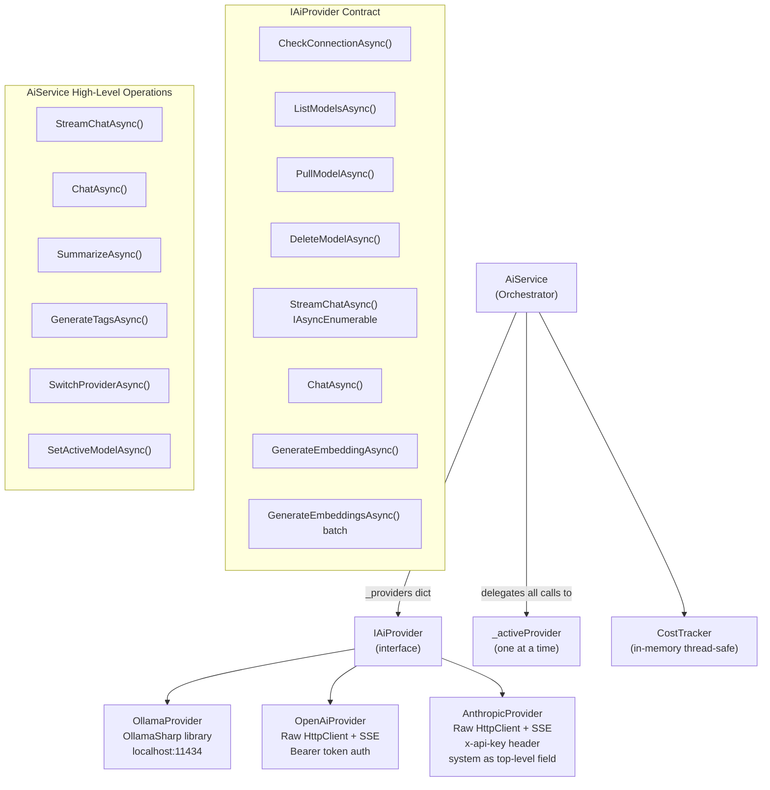

**`IAiProvider`** defines the low-level contract implemented by all three backends:

- `CheckConnectionAsync()` — health check with a 3-second timeout for Ollama.
- `ListModelsAsync()` — returns installed models. Anthropic uses a static catalog (no list-models endpoint).
- `PullModelAsync()` — downloads a model; only meaningful for Ollama.
- `StreamChatAsync()` — returns `IAsyncEnumerable<string>` of tokens via SSE parsing.
- `ChatAsync()` — synchronous variant collecting all tokens.
- `GenerateEmbeddingAsync()` / `GenerateEmbeddingsAsync()` — vector embedding generation.

**`AiService`** orchestrates the providers:

- Maintains a `Dictionary<string, IAiProvider>` keyed by provider ID ("ollama", "openai", "anthropic").
- Ollama is always registered. OpenAI and Anthropic are conditionally registered when API keys are present in settings.
- `SwitchProviderAsync(string providerId)` — swaps the active provider at runtime without restarting the application.
- `PrepareMessages()` — prepends the system prompt as a `role: system` message for Ollama/OpenAI. Anthropic receives the system prompt as a top-level JSON field rather than in the messages array (handled in `AnthropicProvider`).
- `GenerateTagsAsync()` — calls the AI with a JSON array extraction prompt and falls back to comma/line-separated parsing if JSON deserialization fails.

**Provider-specific implementation details:**

| Provider | Library | Auth | Streaming | Embedding |
|---|---|---|---|---|
| Ollama | OllamaSharp 4.0.x | None (local) | Native via library | `/api/embeddings` via library |
| OpenAI | Raw `HttpClient` | `Authorization: Bearer` | SSE `data:` line parsing | `/v1/embeddings` endpoint |
| Anthropic | Raw `HttpClient` | `x-api-key` + `anthropic-version: 2023-06-01` | SSE typed event blocks (`content_block_delta`) | Delegated to Ollama provider |

**`EmbeddingService`** wraps `IAiService.ActiveProvider.GenerateEmbeddingsAsync()` with a configurable batch size of 32. The default embedding model is `all-minilm` (all-MiniLM-L6-v2), producing 384-dimensional float vectors. The `ModelName` is read from `AppSettings.EmbeddingModel` and cached.

**`ContextWindowManager`** handles context window trimming: given a list of chat messages and a token budget, it removes the oldest non-system messages until the total estimated token count fits within the window, always preserving the system prompt and the most recent user message.

**`ExponentialBackoffRetryPolicy`** implements `IRetryPolicy` for transient failures when calling AI providers, with configurable maximum attempts and base delay.

**`CostTracker`** maintains in-memory token counts per provider session (thread-safe via `Interlocked`). It does not persist to disk; it resets on application restart.

**Relevant files:**
- `src/AgentX.Core/AI/AiService.cs`
- `src/AgentX.Core/AI/IAiProvider.cs`
- `src/AgentX.Core/AI/IAiService.cs`
- `src/AgentX.Core/AI/EmbeddingService.cs`
- `src/AgentX.Core/AI/Providers/OllamaProvider.cs`
- `src/AgentX.Core/AI/Providers/OpenAiProvider.cs`
- `src/AgentX.Core/AI/Providers/AnthropicProvider.cs`

### 6.2 Chat Services

The chat service group has four classes with distinct responsibilities:

**`ChatService`** (orchestrator): Receives a `(conversationId, userMessage)` pair and returns `IAsyncEnumerable<string>`. Internally it:
1. Persists the user message via `ConversationService`.
2. Loads the full conversation (messages + system prompt) via `ConversationService`.
3. Injects memory context from `ConversationMemoryService` (up to 8 memories).
4. Builds `ChatOptions` from `AppSettings` (temperature, max tokens, context window).
5. Trims the message list to fit the context window via `ContextWindowManager`.
6. Streams tokens from `IAiService.StreamChatAsync()`, yielding each token to the caller.
7. Persists the complete assistant response after the stream ends.
8. Fires a background `Task.Run` to extract memories from the conversation (non-blocking).

`StopGenerationAsync()` cancels the current stream by signalling a `CancellationTokenSource` that is linked to the generation token. A lock prevents race conditions when multiple stop/start calls occur rapidly.

**`ConversationService`**: CRUD for `ConversationEntity` and `MessageEntity` records. Handles message ordering via a `SortOrder` integer, `AddMessageAsync`, `GetMessagesAsync`, `DeleteLastAssistantMessageAsync` (for regeneration support).

**`SystemPromptService`**: CRUD for `SystemPromptEntity` records, organized by category.

**`ConversationMemoryService`**: AI-driven memory extraction. After each conversation, it asks the AI to extract structured facts in `category|content` format (categories: preference, fact, topic, instruction). Memories are stored in the `memories` table with an `Importance` float and `IsActive` flag. `GetMemoryContextAsync(maxCount)` retrieves the top-N memories sorted by importance and formats them as a system prompt appendix.

**Relevant files:**
- `src/AgentX.Core/Services/Chat/ChatService.cs`
- `src/AgentX.Core/Services/Chat/ConversationService.cs`
- `src/AgentX.Core/Services/Chat/SystemPromptService.cs`
- `src/AgentX.Core/Services/Chat/ConversationMemoryService.cs`

### 6.3 Document Processing Pipeline

**`DocumentService`** is the entry point for all document import operations. Its responsibilities:

- Validates file existence and determines the file extension.
- Computes an SHA-256 content hash via `HashHelper.ComputeFileHashAsync()` and rejects duplicates before processing begins.
- Selects the appropriate `IDocumentProcessor` by calling `processor.CanProcess(filePath)` in registration order.
- Calls `IDocumentProcessor.ProcessAsync(filePath)` to extract text, page count, word count, title, language, and metadata.
- Creates and persists a `DocumentEntity` with `IndexingStatus = "pending"`.
- Optionally creates a `DocumentCollectionEntity` junction record if a `collectionId` is provided.

**Six `IDocumentProcessor` implementations:**

| Processor | Extensions | Key Library | Notes |
|---|---|---|---|
| `PdfProcessor` | `.pdf` | PdfPig | Page-by-page text extraction; preserves page numbers |
| `DocxProcessor` | `.docx` | DocumentFormat.OpenXml | Paragraph-level extraction; preserves headings |
| `TextProcessor` | `.txt`, `.csv`, `.log`, `.xml`, `.json`, `.ini`, `.cfg`, `.toml`, `.yaml`, `.yml` | (built-in) | Reads as UTF-8 text |
| `MarkdownProcessor` | `.md`, `.markdown` | (built-in) | Reads as UTF-8; strips YAML front matter |
| `CodeFileProcessor` | `.cs`, `.py`, `.js`, `.ts`, `.go`, `.rs`, `.java`, `.cpp`, `.c`, `.h`, `.swift`, `.kt`, `.rb`, `.php`, `.sql`, `.sh`, `.html`, `.css`, `.scss`, `.xaml` | (built-in) | Reads as UTF-8; preserves code structure |
| `ImageProcessor` | `.png`, `.jpg`, `.jpeg`, `.bmp`, `.tiff` | (vision model call) | Describes image content via AI vision |

**`ChunkingService`**: Splits a `ProcessedDocument` into overlapping `TextChunk` objects. Default: 512-token chunks with 50-token overlap (configurable in settings). Tracks `StartCharOffset`, `EndCharOffset`, `PageNumber`, and `SectionTitle` for each chunk to enable accurate citation back-references.

**Relevant files:**
- `src/AgentX.Core/Documents/DocumentService.cs`
- `src/AgentX.Core/Documents/ChunkingService.cs`
- `src/AgentX.Core/Documents/Processors/`

### 6.4 Indexing Pipeline

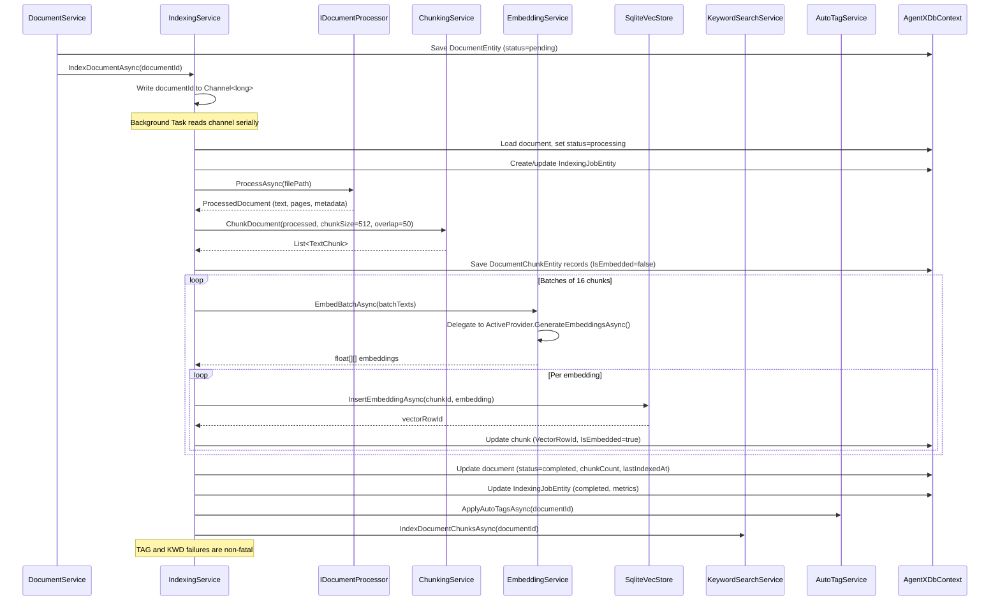

The `IndexingService` handles crash recovery on startup: it resets any `IndexingJobEntity` records left in status "processing" (from a previous application crash) back to "queued" and re-enqueues them into the channel.

`FileWatcherService` uses `System.IO.FileSystemWatcher` to monitor configured `WatchFolder` paths for new or modified files. When changes are detected, it queues the affected files for import and indexing automatically.

**Relevant files:**
- `src/AgentX.Core/Services/Indexing/IndexingService.cs`
- `src/AgentX.Core/Services/Indexing/IndexingQueueService.cs`
- `src/AgentX.Core/Services/Indexing/FileWatcherService.cs`

### 6.5 Search and RAG Pipeline

#### Semantic Search

`SemanticSearchService.SearchAsync(query)`:
1. Calls `EmbeddingService.EmbedAsync(query.QueryText)` to produce a 384-dim query vector.
2. Calls `SqliteVecStore.SearchAsync(queryEmbedding, topK, minSimilarity=0.3)` to retrieve the most similar chunk IDs via full-scan cosine similarity.
3. Loads the corresponding `DocumentChunkEntity` and `DocumentEntity` records from EF Core.
4. Applies optional filters (collection, file type, date range) in SQL.
5. Returns `SearchResult` objects with matched text, excerpts, scores, and collection memberships.

#### Keyword Search (FTS5)

`KeywordSearchService` creates a SQLite FTS5 virtual table (`document_chunks_fts`) populated during indexing via `IndexDocumentChunksAsync`. Searches use SQLite's built-in BM25 ranking function. `InitializeFtsAsync()` creates the virtual table on startup if absent.

#### Hybrid Search (Reciprocal Rank Fusion)

`HybridSearchOrchestrator.SearchAsync(query)` routes by `SearchMode`:

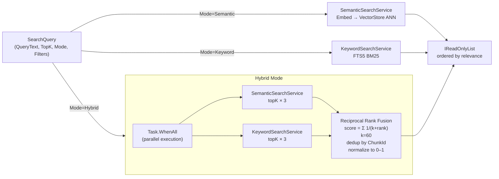

**Reciprocal Rank Fusion formula:**

For each unique chunk appearing in either result list, the RRF score accumulates contributions from every list it appears in:

```
RRF_score(chunk) = Σ  1 / (k + rank_i)
```

where `rank_i` is the 1-based rank of the chunk in result list `i`, and `k = 60` is the constant from the Cormack, Clarke and Buettcher (2009) paper. The maximum possible score is `2 / (60 + 1) ≈ 0.0328` (when ranked first in both lists). Scores are normalized to [0, 1] for display consistency.

Graceful degradation: if one backend fails during hybrid execution, `HybridSearchOrchestrator` falls back to the results from the surviving backend.

#### RAG Pipeline

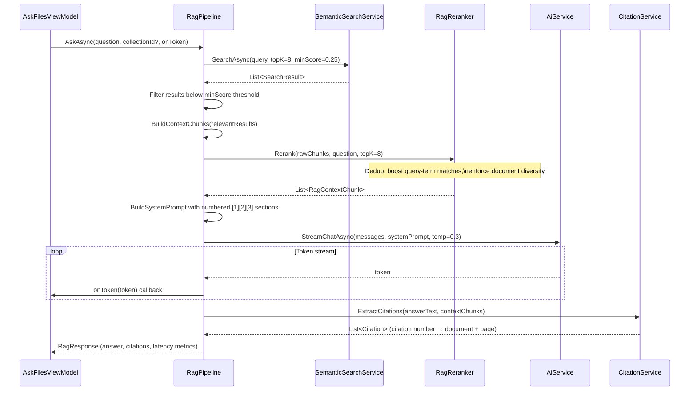

The RAG system prompt instructs the AI to answer using only the numbered context sections and to cite sources using `[1]`, `[2]`, etc. Temperature is fixed at 0.3 for RAG queries (lower than the default 0.7 for free chat) to improve factual grounding.

**Relevant files:**
- `src/AgentX.Core/Search/SemanticSearchService.cs`
- `src/AgentX.Core/Search/KeywordSearchService.cs`
- `src/AgentX.Core/Search/HybridSearchOrchestrator.cs`
- `src/AgentX.Core/Search/RagPipeline.cs`
- `src/AgentX.Core/Search/CitationService.cs`
- `src/AgentX.Core/Search/RagReranker.cs`

### 6.6 Intelligence Services

**`SummaryService`**: Calls `IAiService.ChatAsync()` with a focused summarization system prompt. Returns a 2–3 paragraph summary. Used by `QuickActionsPage` for per-document and multi-document summarization.

**`DuplicateDetectionService`**: Queries `DocumentService.CheckForDuplicateAsync()` for exact SHA-256 hash matches. A future near-duplicate detection pass (embedding cosine similarity above a threshold) is scaffolded but not yet activated.

**`OrganizationSuggestionService`**: Analyzes document metadata, tags, and collection memberships to generate AI-powered suggestions for how to organize the vault (collection merges, tag consolidation).

**`KnowledgeGraphService`**: Builds a force-directed graph data model from the document vault:

- **Node types:** Documents (blue, `#3B82F6`), Collections (purple, `#8B5CF6`), Tags (amber, `#F59E0B`). Node size scales with `ChunkCount` for documents (clamped to 14–40), fixed 32 for collections, 16 for tags.
- **Edge types:** Document→Collection (indigo), Document→Tag (amber-dark), Document→Document for shared collection/tag memberships (gray), weighted by shared connection count.
- **Layout:** 100 iterations of spring-electric force-directed layout: Coulomb-like repulsion (`F = 5000 / d²`), Hooke spring attraction along edges (`F = 0.01 × (d − 100)`), center gravity (`F = 0.01 × position`), velocity damping `0.85` per iteration. Initial positions use a seeded random (`seed=42`) for reproducible layouts.
- The computed `(X, Y)` positions are used by `KnowledgeGraphPage` to render nodes and edges on a WinUI 3 `Canvas`.

**`DigestService`**: Generates weekly activity summary reports by querying the database for:
- New document count in the period.
- New conversation count.
- Total search query count.
- Token usage sum from messages.
- Top 5 search queries by frequency.
- Top 5 active collections by document count.
- List of recently active conversations.

Results are serialized to JSON and persisted as a `DigestReportEntity`.

**Relevant files:**
- `src/AgentX.Core/Services/Intelligence/KnowledgeGraphService.cs`
- `src/AgentX.Core/Services/Intelligence/DigestService.cs`
- `src/AgentX.Core/Services/Intelligence/SummaryService.cs`
- `src/AgentX.Core/Services/Intelligence/DuplicateDetectionService.cs`

### 6.7 Collections and Tagging

**`CollectionService`**: Full CRUD for `CollectionEntity`, including nested collection support (self-referencing parent/child hierarchy). Queries for documents by collection. Updates the `DocumentCount` denormalized field on the collection entity.

**`AutoTagService`**: After a document is fully indexed, calls `IAiService.GenerateTagsAsync(content, maxTags=5)` with the document's extracted text (truncated to avoid token overflow). Tags are normalized to lowercase, deduplicated, and stored in `TagEntity` / `DocumentTagEntity` junction records with an `IsAutoGenerated = true` flag and a `Confidence` score from the AI response.

**Relevant files:**
- `src/AgentX.Core/Services/Collections/CollectionService.cs`
- `src/AgentX.Core/Services/Tagging/AutoTagService.cs`

### 6.8 Settings and License Services

**`SettingsService`**: Reads and writes `AppSettings` as JSON to `%LocalAppData%/AgentX/settings.json`. Provides async `GetSettingsAsync()` and `SaveSettingsAsync()` with file locking to prevent concurrent write corruption. Initializes defaults on first run.

**`AppSettings`** key properties:

| Property | Default | Description |
|---|---|---|
| `ActiveProviderId` | `"ollama"` | Currently active AI provider |
| `OllamaEndpoint` | `http://localhost:11434` | Ollama server URL |
| `DefaultModel` | `"llama3.2"` | Default Ollama chat model |
| `EmbeddingModel` | `"all-minilm"` | Embedding model (384 dims) |
| `OpenAiApiKey` | `null` | OpenAI key (optional) |
| `OpenAiDefaultModel` | `"gpt-4o-mini"` | OpenAI default model |
| `AnthropicApiKey` | `null` | Anthropic key (optional) |
| `AnthropicDefaultModel` | `"claude-sonnet-4-20250514"` | Anthropic default model |
| `Temperature` | `0.7` | Inference temperature |
| `MaxTokens` | `4096` | Max response tokens |
| `ContextWindow` | `8192` | Context window size |
| `ChunkSize` | `512` | Document chunk token size |
| `ChunkOverlap` | `50` | Chunk overlap tokens |
| `TopKResults` | `5` | Search result count |
| `StoragePath` | `%LocalAppData%/AgentX` | Base storage directory |

**`LicenseService`**: Reads and validates `LicenseEntity` records from the database. Exposes `GetCurrentTierAsync()` for feature gating. Four tiers are defined:

| Tier | Price | Document Limit | Features |
|---|---|---|---|
| Trial | Free | 50 documents | Basic chat, basic models |
| Starter | $79 | 500 documents | All chat models |
| Professional | $149 | Unlimited | All features + intelligence services |
| Ultimate | $249 | Unlimited | All features + priority support |

---

## 7. Data Layer (AgentX.Core/Data)

### 7.1 Entity Framework Core Database Context

`AgentXDbContext` uses SQLite via the `Microsoft.EntityFrameworkCore.Sqlite` package. The database file is stored at `%LocalAppData%/AgentX/agentx.db`. The context is registered as a singleton and schema changes are applied at startup via `IMigrationRunner` (see 7.1.1 below).

SQLite WAL (Write-Ahead Logging) mode is enabled by the `SqliteVecStore` for the vec_embeddings connection. The main EF Core connection operates in shared cache mode on the same file.

**Database path:** `Path.Combine(Environment.GetFolderPath(Environment.SpecialFolder.LocalApplicationData), "AgentX", "agentx.db")`

#### 7.1.1 Migrations

Schema changes ship via EF Core migrations under `src/AgentX.Core/Data/Migrations/`. `IMigrationRunner` is invoked during `App.InitializeCoreServicesAsync` to apply any pending migrations at launch. Pre-migration installs are automatically adopted at the `InitialBaseline` migration so existing user data is preserved on first run after upgrade.

The runner is implemented in `src/AgentX.Core/Data/MigrationRunner/MigrationRunner.cs` and exposes two methods:

- `RunAsync()` — applies pending migrations and returns a `MigrationResult` with the database path, whether the database was newly created, and which migrations were applied.
- `GetPendingMigrationsAsync()` — returns pending migration names without applying them (used for UI surfacing).

The `AgentXDbContextFactory` is an `IDesignTimeDbContextFactory<AgentXDbContext>` used by the `dotnet ef` tooling to create new migrations. To author a migration:

```bash
dotnet ef migrations add <MigrationName> \
  --project src/AgentX.Core/AgentX.Core.csproj \
  --output-dir Data/Migrations \
  --context AgentXDbContext
```

Baseline adoption covers users upgrading from pre-B9 builds where `EnsureCreatedAsync()` created the schema without an `__EFMigrationsHistory` table. On first launch after upgrade, `MigrationRunner.RunAsync` detects the missing history table, writes the `InitialBaseline` row to mark the schema as already at baseline, and only applies migrations newer than the baseline.

### 7.2 Entity Relationship Model

```mermaid
erDiagram
    Conversation {
        long Id PK
        string Title
        string ModelId
        string SystemPrompt
        bool IsPinned
        int MessageCount
        DateTime CreatedAt
        DateTime UpdatedAt
    }

    Message {
        long Id PK
        long ConversationId FK
        string Role
        string Content
        int SortOrder
        int TokenCount
        double GenerationTimeMs
        DateTime Timestamp
    }

    Document {
        long Id PK
        string FileName
        string FilePath
        string FileType
        string MimeType
        long FileSizeBytes
        string ContentHash
        string IndexingStatus
        string IndexingError
        int ChunkCount
        int PageCount
        int WordCount
        string ExtractedTitle
        string Language
        string MetadataJson
        DateTime ImportedAt
        DateTime FileModifiedAt
        DateTime LastIndexedAt
    }

    DocumentChunk {
        long Id PK
        long DocumentId FK
        int ChunkIndex
        string Content
        int StartCharOffset
        int EndCharOffset
        int PageNumber
        string SectionTitle
        int TokenCount
        bool IsEmbedded
        long VectorRowId
    }

    Collection {
        long Id PK
        string Name
        string Description
        string ColorHex
        string IconGlyph
        int DocumentCount
        long ParentCollectionId FK
        DateTime CreatedAt
        DateTime UpdatedAt
    }

    DocumentCollection {
        long DocumentId PK_FK
        long CollectionId PK_FK
        DateTime AddedAt
    }

    Tag {
        long Id PK
        string Name
        string ColorHex
        bool IsAutoGenerated
        DateTime CreatedAt
    }

    DocumentTag {
        long DocumentId PK_FK
        long TagId PK_FK
        float Confidence
        bool IsAutoGenerated
        DateTime AssignedAt
    }

    SearchHistory {
        long Id PK
        string Query
        string SearchType
        int ResultCount
        double SearchDurationMs
        DateTime SearchedAt
    }

    SystemPrompt {
        long Id PK
        string Name
        string Content
        string Category
        bool IsDefault
        DateTime CreatedAt
        DateTime UpdatedAt
    }

    UserSettings {
        long Id PK
        string Key UK
        string Value
        string ValueType
        DateTime UpdatedAt
    }

    WatchFolder {
        long Id PK
        string FolderPath UK
        bool IsEnabled
        bool IncludeSubfolders
        long TargetCollectionId FK
        DateTime CreatedAt
        DateTime LastScannedAt
    }

    IndexingJob {
        long Id PK
        long DocumentId FK
        string Status
        int ChunksProcessed
        int EmbeddingsGenerated
        double ProcessingTimeMs
        string ErrorMessage
        DateTime QueuedAt
        DateTime StartedAt
        DateTime CompletedAt
    }

    License {
        long Id PK
        string LicenseKey
        string Tier
        string Email
        DateTime ActivatedAt
        DateTime ExpiresAt
    }

    Memory {
        long Id PK
        string Content
        string Category
        double Importance
        bool IsActive
        long SourceConversationId
        DateTime CreatedAt
    }

    DigestReport {
        long Id PK
        int NewDocumentCount
        int NewConversationCount
        int TotalSearches
        long TokensUsed
        string TopSearchQueriesJson
        string TopCollectionsJson
        string ConversationHighlightsJson
        bool IsRead
        DateTime GeneratedAt
        DateTime PeriodStart
        DateTime PeriodEnd
    }

    Conversation ||--o{ Message : "has"
    Document ||--o{ DocumentChunk : "chunked into"
    Document ||--o{ DocumentCollection : "member of"
    Collection ||--o{ DocumentCollection : "contains"
    Collection ||--o{ Collection : "parent of"
    Document ||--o{ DocumentTag : "tagged with"
    Tag ||--o{ DocumentTag : "applied to"
    Document ||--o{ IndexingJob : "tracked by"
    Collection ||--o{ WatchFolder : "targeted by"
```

### 7.3 Vector Store Implementation

`SqliteVecStore` stores embeddings in a separate table within the same `agentx.db` file:

```sql
CREATE TABLE IF NOT EXISTS vec_embeddings (
    chunk_id  INTEGER PRIMARY KEY,
    embedding BLOB NOT NULL,     -- float[] via Buffer.BlockCopy, 4 bytes per dimension
    magnitude REAL NOT NULL      -- pre-computed L2 norm for fast cosine similarity
);

CREATE INDEX IF NOT EXISTS idx_vec_chunk ON vec_embeddings(chunk_id);
```

**Search algorithm:** Full table scan with C# cosine similarity computation:

```
cosine_similarity(a, b) = dot(a, b) / (|a| × |b|)
```

Pre-computed magnitudes avoid square root recalculation per comparison. Results below `minSimilarity = 0.3` are filtered before sorting. The top-K are selected from all passing candidates.

**Performance envelope:** The C# full-scan approach is suitable for collections up to approximately 100,000 embeddings on modern hardware. For a 100K embedding database with 384-dimensional vectors: each embedding is 384 × 4 = 1,536 bytes; total blob data ≈ 150 MB in RAM during a search scan. A search completes in well under 1 second on modern hardware at this scale.

**Design rationale:** This approach was chosen over the `sqlite-vec` native extension to ensure portability across all Windows machines without requiring native library deployment. The installer does not need to ship additional DLLs or register extension modules.

**Relevant files:**
- `src/AgentX.Core/Data/VectorDb/SqliteVecStore.cs`
- `src/AgentX.Core/Data/VectorDb/IVectorStore.cs`
- `src/AgentX.Core/Data/VectorDb/VectorSearchResult.cs`

---

## 8. Key Data Flows

### 8.1 Document Import Flow

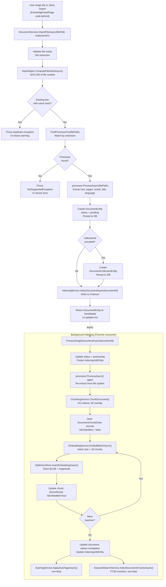

### 8.2 Chat and Streaming Flow

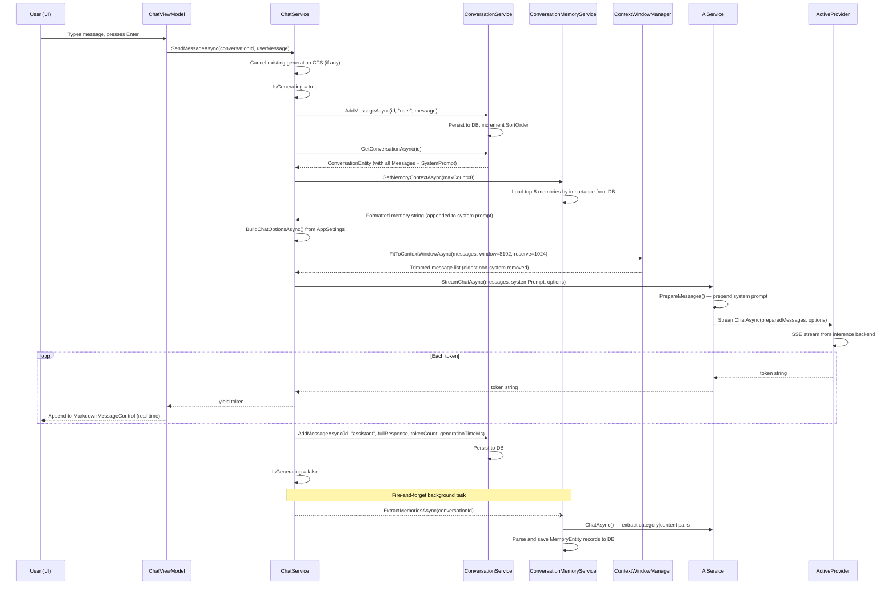

### 8.3 RAG (Ask Files) Flow

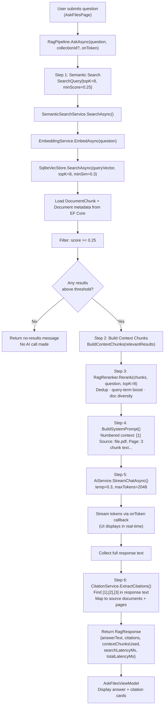

### 8.4 Search Mode Routing and Hybrid Search

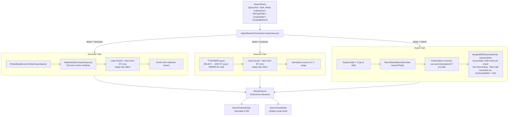

### 8.5 Knowledge Graph Construction Flow

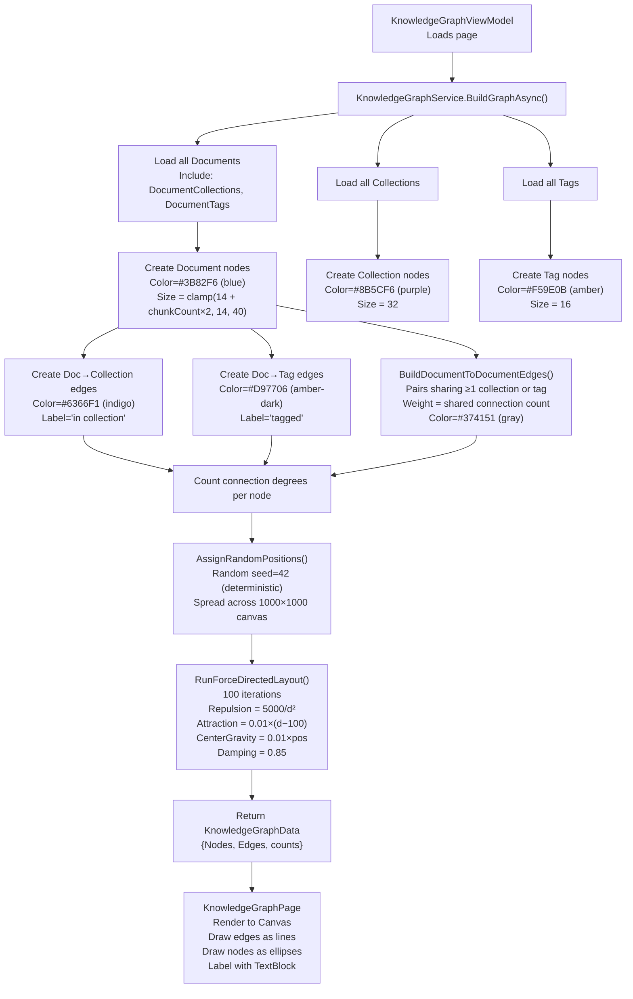

---

## 9. Navigation Architecture

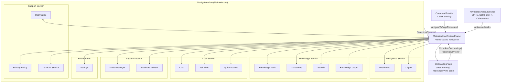

All 16 page types are registered in the `_pageMap` dictionary. Navigation can be triggered by three independent mechanisms: NavigationView item selection, keyboard shortcut (via `KeyboardShortcutService`), or command palette action. All three paths converge on `MainWindow.NavigateToPage(pageTag)`, which calls `ContentFrame.Navigate(pageType)` and synchronizes `NavView.SelectedItem` to keep the visual indicator consistent.

The `_suppressNavigation` flag prevents re-entrancy when onboarding setup programmatically modifies `NavView.SelectedItem` (clearing it to null and hiding the pane). Without this guard, the `SelectionChanged` event would trigger a navigation to `null` page type.

---

## 10. Dependency Injection Configuration

All service registrations are in `App.xaml.cs` `ConfigureServices()`. The complete registration table:

| Service | Interface | Implementation | Lifetime |
|---|---|---|---|
| `Serilog.ILogger` | — | `Log.Logger` | Singleton |
| `AgentXDbContext` | — | `AgentXDbContext` | Singleton |
| `ISettingsService` | `ISettingsService` | `SettingsService` | Singleton |
| `ILicenseService` | `ILicenseService` | `LicenseService` | Singleton |
| `KeyboardShortcutService` | — | `KeyboardShortcutService` | Singleton |
| `IAiService` | `IAiService` | `AiService` | Singleton |
| `ICostTracker` | `ICostTracker` | `CostTracker` | Singleton |
| `IModelManager` | `IModelManager` | `ModelManager` | Singleton |
| `IHardwareDetector` | `IHardwareDetector` | `HardwareDetector` | Singleton |
| `IEmbeddingService` | `IEmbeddingService` | `EmbeddingService` | Singleton |
| `IContextWindowManager` | `IContextWindowManager` | `ContextWindowManager` | Singleton |
| `IRetryPolicy` | `IRetryPolicy` | `ExponentialBackoffRetryPolicy` | Singleton |
| `IVectorStore` | `IVectorStore` | `SqliteVecStore` | Singleton |
| `IConversationService` | `IConversationService` | `ConversationService` | Singleton |
| `ISystemPromptService` | `ISystemPromptService` | `SystemPromptService` | Singleton |
| `IConversationMemoryService` | `IConversationMemoryService` | `ConversationMemoryService` | Singleton |
| `IChatService` | `IChatService` | `ChatService` | Singleton |
| `IDocumentProcessor` | `IDocumentProcessor` | `PdfProcessor` | Singleton |
| `IDocumentProcessor` | `IDocumentProcessor` | `DocxProcessor` | Singleton |
| `IDocumentProcessor` | `IDocumentProcessor` | `TextProcessor` | Singleton |
| `IDocumentProcessor` | `IDocumentProcessor` | `MarkdownProcessor` | Singleton |
| `IDocumentProcessor` | `IDocumentProcessor` | `CodeFileProcessor` | Singleton |
| `IDocumentProcessor` | `IDocumentProcessor` | `ImageProcessor` | Singleton |
| `IDocumentService` | `IDocumentService` | `DocumentService` | Singleton |
| `IChunkingService` | `IChunkingService` | `ChunkingService` | Singleton |
| `IIndexingQueueService` | `IIndexingQueueService` | `IndexingQueueService` | Singleton |
| `IIndexingService` | `IIndexingService` | `IndexingService` | Singleton |
| `IFileWatcherService` | `IFileWatcherService` | `FileWatcherService` | Singleton |
| `ICollectionService` | `ICollectionService` | `CollectionService` | Singleton |
| `IAutoTagService` | `IAutoTagService` | `AutoTagService` | Singleton |
| `ISemanticSearchService` | `ISemanticSearchService` | `SemanticSearchService` | Singleton |
| `IKeywordSearchService` | `IKeywordSearchService` | `KeywordSearchService` | Singleton |
| `IHybridSearchOrchestrator` | `IHybridSearchOrchestrator` | `HybridSearchOrchestrator` | Singleton |
| `ICitationService` | `ICitationService` | `CitationService` | Singleton |
| `IRagReranker` | `IRagReranker` | `RagReranker` | Singleton |
| `IRagPipeline` | `IRagPipeline` | `RagPipeline` | Singleton |
| `ISummaryService` | `ISummaryService` | `SummaryService` | Singleton |
| `IDuplicateDetectionService` | `IDuplicateDetectionService` | `DuplicateDetectionService` | Singleton |
| `IOrganizationSuggestionService` | `IOrganizationSuggestionService` | `OrganizationSuggestionService` | Singleton |
| `IKnowledgeGraphService` | `IKnowledgeGraphService` | `KnowledgeGraphService` | Singleton |
| `IDigestService` | `IDigestService` | `DigestService` | Singleton |
| All 13 ViewModels | — | concrete types | Transient |
| All 16 Views/Pages | — | concrete types | Transient |

`IDocumentProcessor` is registered six times — one per concrete type — as the same interface. `DocumentService` receives `IEnumerable<IDocumentProcessor>` which the DI container resolves as all registered implementations. Processors are tried in registration order, stopping at the first that returns `true` from `CanProcess()`.

---

## 11. Storage Architecture

```
%LocalAppData%\AgentX\
├── agentx.db                    # SQLite: EF Core entities + vec_embeddings table
│                                # WAL mode enabled
├── settings.json                # AppSettings serialized as JSON
│                                # Written by SettingsService
└── Logs\
    ├── agentx-20260227.log      # Today's log (rolling daily)
    ├── agentx-20260226.log      # Yesterday's log
    └── ...                      # Up to 7 days retained
```

**SQLite database internal structure:**

```
agentx.db
├── conversations                # ConversationEntity
├── messages                     # MessageEntity
├── documents                    # DocumentEntity (with content hash index)
├── document_chunks              # DocumentChunkEntity (with vector_row_id FK)
├── collections                  # CollectionEntity (self-referencing hierarchy)
├── document_collections         # Junction table (composite PK)
├── tags                         # TagEntity (unique name index)
├── document_tags                # Junction table with confidence score
├── search_history               # SearchHistoryEntity
├── system_prompts               # SystemPromptEntity
├── user_settings                # Key-value store (unique key index)
├── watch_folders                # WatchFolderEntity (unique path index)
├── indexing_jobs                # IndexingJobEntity
├── licenses                     # LicenseEntity
├── memories                     # MemoryEntity (category/importance indexes)
├── digest_reports               # DigestReportEntity
├── vec_embeddings               # BLOB store: chunk_id, embedding, magnitude
├── document_chunks_fts          # FTS5 virtual table (keyword search)
└── (EF Core migration table)    # __EFMigrationsHistory
```

**File format notes:**
- `settings.json` uses `System.Text.Json` serialization with camelCase naming. API keys are stored in plaintext. Future versions should use DPAPI encryption.
- Embedding BLOBs: each `float32` is 4 bytes; a 384-dimensional embedding occupies 1,536 bytes. The `magnitude` column stores the pre-computed L2 norm as a `REAL`.
- Log format: `{Timestamp:yyyy-MM-dd HH:mm:ss.fff} [{Level:u3}] {Message:lj}{NewLine}{Exception}`.

---

## 12. Startup Sequence

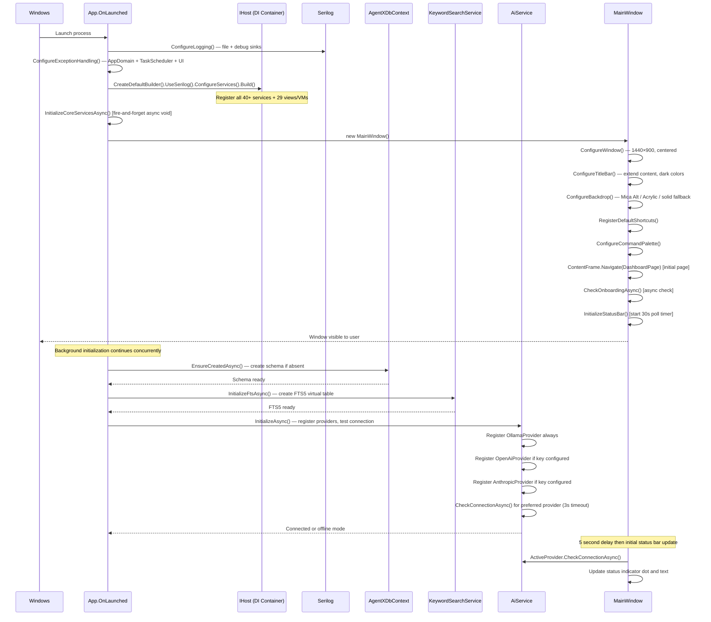

---

## 13. Error Handling and Resilience

The system employs a layered error handling strategy:

**Application Level:**
- `AppDomain.CurrentDomain.UnhandledException` — logs fatal errors and flushes Serilog before process terminates.
- `TaskScheduler.UnobservedTaskException` — logs errors and marks exceptions as observed (prevents crash on .NET 6+ where unobserved task exceptions do not terminate the process by default, but still suppresses any runtime warnings).
- `Application.UnhandledException` — logs and marks `e.Handled = true` to prevent WinUI 3 from showing the default crash dialog.

**Service Level:**
- AI provider operations wrap all calls in `try/catch`. Failed health checks set `IsAvailable = false` without throwing.
- `InitializeAsync()` on `AiService` does not propagate exceptions back to the startup caller; a failure results in offline mode with a warning log.
- `IndexingService` marks documents as `status=failed` with the error message stored in `IndexingError` when any step of the pipeline throws. Processing continues with the next queued document.
- FTS5 indexing and auto-tagging within the indexing pipeline are wrapped in non-fatal catch blocks — their failures are logged as warnings but do not abort the primary indexing work.
- `HybridSearchOrchestrator` gracefully degrades to single-backend results when one search backend fails.

**Cancellation:**
- `ChatService` links a caller-provided `CancellationToken` with an internal `CancellationTokenSource` owned by the service. `StopGenerationAsync()` signals this internal source without affecting the caller's token. This allows the user's "Stop" button to cancel generation independently of any page navigation cancellation.
- All `async` operations in `IndexingService` accept a `CancellationToken` that is connected to `_shutdownCts` (cancelled on `Dispose()`). On application exit, the indexing loop stops cleanly within 5 seconds.

**Onboarding Recovery:**
- If `OnboardingPage` fails to navigate (rare WinUI 3 Frame issues), `CheckOnboardingAsync()` catches the exception, marks onboarding as complete, and routes to Dashboard. The nav pane is always restored via `EnsureNavPaneVisible()` in both success and failure paths.

---

## 14. License Tiers and Feature Gating

`LicenseService.GetCurrentTierAsync()` reads the active `LicenseEntity` from the database to determine the user's tier. Feature gates are checked in ViewModels before allowing operations that exceed the tier's limits.


---

## 15. Testing Architecture

The `AgentX.Tests` project uses xUnit and mirrors the `AgentX.Core` namespace structure:

```
tests/AgentX.Tests/
├── AI/                    # AiService, EmbeddingService, provider unit tests
├── Data/                  # SqliteVecStore serialization and cosine similarity tests
├── Documents/             # ChunkingService, processor output tests
├── Helpers/               # HashHelper tests
├── Search/                # HybridSearchOrchestrator, RRF algorithm tests
└── Services/              # ChatService, IndexingService, intelligence service tests
```

Key testing strategies:
- `SqliteVecStore` tests use an in-memory SQLite connection (`DataSource=:memory:`).
- `AiService` tests use mock `IAiProvider` implementations that return predictable token streams.
- `HybridSearchOrchestrator` tests verify RRF score calculation with known ranked inputs.
- `ChunkingService` tests verify chunk boundaries, overlap, and page number propagation.
- `HashHelper` tests verify SHA-256 output consistency and file-not-found behavior.

ViewModels and Views are not unit tested directly due to WinUI 3's requirement for a live HWND for most operations. Integration testing of the UI layer is done via manual test procedures documented in `docs/DEVELOPER-GUIDE.md`.

---

## 16. Deployment and Distribution

The application is distributed as a self-contained Windows installer built with Inno Setup (`installer/AgentX.iss`).

**Build pipeline:**
1. `dotnet publish -c Release -r win-x64 --self-contained true` produces the `publish/win-x64/` directory with all required .NET runtime files bundled.
2. Inno Setup compiles the installer from `AgentX.iss`, packaging the publish output into `installer-output/AgentX-Setup-1.0.0-x64.exe`.

**Installer behavior:**
- Installs to `%ProgramFiles%/AgentX/` by default.
- Creates Start Menu entry and Desktop shortcut.
- Registers an uninstaller in Add/Remove Programs.
- Does NOT install any system-level native extensions. The application is fully portable.

**Runtime requirements:**
- Windows 10 (build 19041+) or Windows 11.
- Windows App SDK 1.6 (bootstrapped by the application if not already present).
- Ollama (optional, installed separately by the user) for local model inference.

**Published binaries:**
- `publish/win-x64/AgentX.App.exe` — main executable.
- `publish/win-x64/AgentX.App.dll` — managed assembly.
- `publish/win-x64/AgentX.Core.dll` — core library.
- All .NET 8 runtime files bundled (self-contained).

---

## 17. Performance Characteristics

| Operation | Typical Latency | Bottleneck |
|---|---|---|
| Application startup (window visible) | < 1 second | WinUI 3 frame initialization |
| DB schema creation (first run) | < 500 ms | SQLite file creation |
| FTS5 table initialization | < 100 ms | SQLite DDL |
| Ollama connection check | < 3 seconds (timeout) | Network/process |
| Document import (text extraction) | 100 ms – 2 seconds | File I/O, processor type |
| Chunking (512-token, 50k words) | < 200 ms | CPU string processing |
| Embedding batch (16 chunks, all-minilm) | 2 – 10 seconds | Ollama inference |
| Full indexing pipeline per document | 5 – 30 seconds | Embedding generation dominates |
| Vector search (10K embeddings) | < 50 ms | C# cosine similarity scan |
| Vector search (100K embeddings) | 200 – 500 ms | C# cosine similarity scan |
| FTS5 keyword search | < 20 ms | SQLite FTS5 |
| Hybrid search (10K embeddings) | < 100 ms | Parallel execution |
| RAG pipeline (search + generation) | 5 – 30 seconds | AI generation dominates |
| Chat streaming (first token) | 1 – 5 seconds | Model warmup |
| Knowledge graph (100 documents) | 100 – 300 ms | Force-directed layout (100 iterations) |
| Digest generation | 200 – 500 ms | DB aggregate queries |
| Memory extraction (background) | 3 – 10 seconds | AI inference |

**Scaling limits:**
- SQLite handles up to several GB of data without performance degradation for this access pattern (mostly keyed lookups and small scans).
- Vector search degrades linearly with embedding count. At 100K chunks, the full-scan approach hits approximately 500 ms. Beyond this scale, ANN indexing (FAISS, HNSW) would be required.
- The `Channel<long>` indexing queue handles unlimited document backlog; throughput is limited by embedding model inference speed.

---

## 18. Security Model

**Threat model:** Agent-X is a local desktop application with no server component. The primary security concerns are:

**API Key Storage:**
- OpenAI and Anthropic API keys are stored in plaintext in `settings.json` within the user's `%LocalAppData%` directory. This directory is protected by Windows user-level ACLs but is not encrypted.
- Future mitigation: DPAPI (`System.Security.Cryptography.ProtectedData`) encryption of sensitive fields in `settings.json`.
- API keys are never logged (Serilog configuration does not include structured property capture for settings objects).

**Input Validation:**
- All SQL queries use Entity Framework Core parameterized queries. No dynamic SQL string concatenation occurs in EF Core model operations.
- The `SqliteVecStore` uses parameterized `IN` clauses for bulk deletes.
- The `KeywordSearchService` FTS5 queries use `MATCH` with parameterized values, preventing FTS5 injection.
- File paths accepted from the user are validated for existence before processing. Content hash computation occurs before any AI processing.

**Local Network:**
- Ollama communication is exclusively over `http://localhost:11434`. No external network traffic occurs for local inference.
- OpenAI and Anthropic calls use `HttpClient` with TLS (HTTPS enforced by the endpoint URIs). No certificate pinning.

**File System:**
- The application reads files from user-specified paths. It does not write back to source files.
- Import creates a new `DocumentEntity` record but does not copy file data to the storage directory — original file paths are stored as references.
- Log files contain only application operation logs, never document content.

**License Validation:**
- License validation is performed locally against the `LicenseEntity` database record. The license key format and validation algorithm are internal to `LicenseService`.

---

## 19. Glossary

| Term | Definition |
|---|---|
| **AiService** | The `AgentX.Core` singleton that orchestrates AI inference providers, model selection, and high-level operations (summarize, tag). |
| **all-minilm** | The `all-MiniLM-L6-v2` embedding model served via Ollama, producing 384-dimensional float vectors. Default embedding model. |
| **BM25** | Best Match 25 — the probabilistic ranking function used by SQLite FTS5 for keyword search scoring. |
| **Chunk** | A fixed-size fragment of a document's text (default 512 tokens, 50-token overlap) stored as a `DocumentChunkEntity` and embedded as a vector. |
| **CommunityToolkit.Mvvm** | A Microsoft-maintained .NET MVVM library providing source generators for `[ObservableProperty]`, `[RelayCommand]`, and `ObservableObject`. |
| **Cosine Similarity** | A measure of angle between two vectors in high-dimensional space, computed as `dot(a,b) / (|a| × |b|)`, ranging from -1 to 1. Used for semantic similarity. |
| **DPAPI** | Windows Data Protection API — a Windows-level symmetric encryption facility tied to the user account. Not yet used; planned for API key encryption. |
| **EF Core** | Entity Framework Core — Microsoft's ORM for .NET, used here with the SQLite provider. |
| **FTS5** | Full-Text Search version 5 — SQLite's built-in full-text search engine using the BM25 ranking algorithm. |
| **IAiProvider** | The core interface implemented by `OllamaProvider`, `OpenAiProvider`, and `AnthropicProvider`, defining the contract for chat, embedding, and model management. |
| **IAsyncEnumerable** | A C# interface for asynchronous sequences, used to stream AI response tokens one at a time from provider to ViewModel. |
| **Indexing Pipeline** | The background process that takes a `pending` document through text re-extraction, chunking, embedding generation, vector storage, FTS5 indexing, and auto-tagging. |
| **Knowledge Vault** | The user-facing name for the document library — all imported, indexed documents stored in `AgentXDbContext`. |
| **Mica** | A Windows 11 system backdrop material that incorporates desktop content behind the application window for a translucent effect. |
| **MVVM** | Model-View-ViewModel — the architectural pattern used in the presentation layer, separating UI state (ViewModel) from UI structure (View). |
| **OllamaSharp** | The official .NET client library for the Ollama API, used by `OllamaProvider` for model management and inference. |
| **RAG** | Retrieval-Augmented Generation — the technique of retrieving relevant document chunks via semantic search and injecting them as context into an AI prompt to produce grounded answers. |
| **RRF** | Reciprocal Rank Fusion — the algorithm for combining ranked lists from multiple search backends, scoring each item as `Σ 1/(k+rank_i)`. |
| **Serilog** | A structured logging library for .NET, used throughout `AgentX.Core` and `AgentX.App`. |
| **SqliteVecStore** | The `AgentX.Core` implementation of `IVectorStore` that stores embedding BLOBs in SQLite and computes cosine similarity in C#. |
| **SSE** | Server-Sent Events — the HTTP streaming format used by OpenAI and Anthropic APIs to deliver generated tokens incrementally (`data: {...}` lines). |
| **Temperature** | An AI inference parameter (0.0–2.0) controlling response randomness. Default 0.7 for chat; 0.3 for RAG queries. |
| **VectorRowId** | The `chunk_id` foreign key stored on `DocumentChunkEntity` that links a chunk to its row in `vec_embeddings`. |
| **WAL** | Write-Ahead Logging — a SQLite journal mode that improves concurrent read/write performance by writing changes to a separate log file before committing to the main database. |
| **WinUI 3** | Windows UI Library 3 — Microsoft's modern UI framework for Windows desktop apps, part of the Windows App SDK. Used for all presentation layer components. |
| **Watch Folder** | A directory monitored by `FileWatcherService` using `System.IO.FileSystemWatcher`. New or modified files are automatically queued for import and indexing. |

---

*This document reflects the Agent-X codebase as of version 1.0, build date 2026-02-27. All file paths are relative to the solution root at `src/AgentX.App/` and `src/AgentX.Core/` respectively.*
