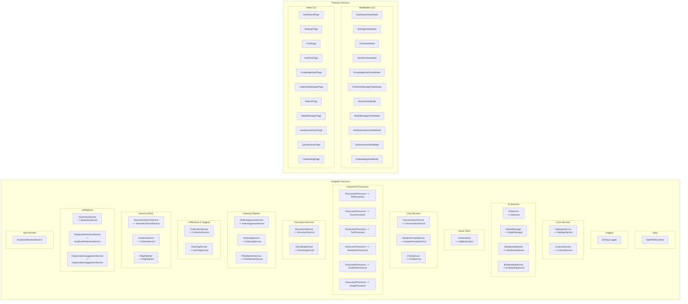
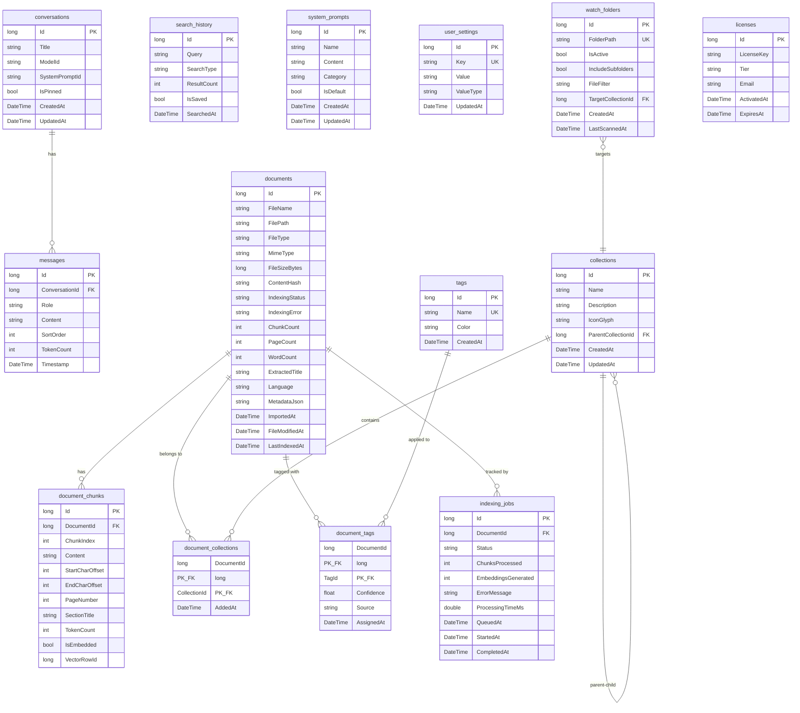
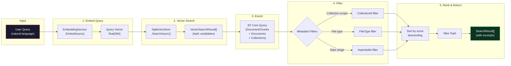
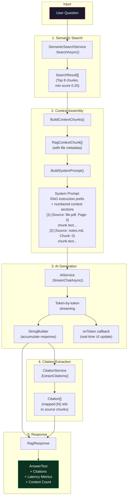
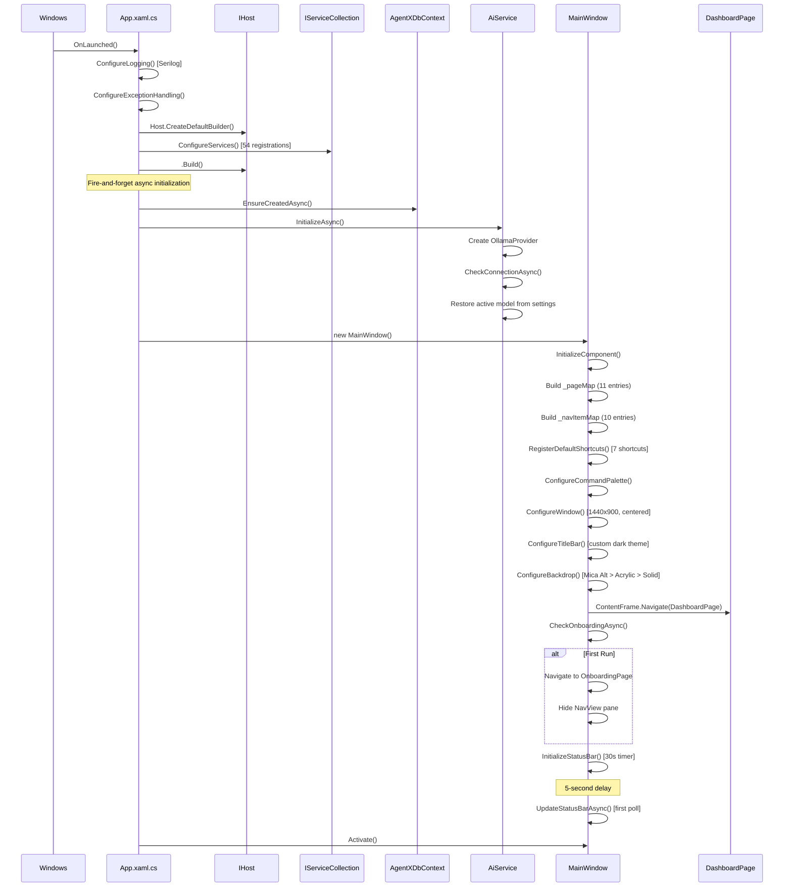

# Agent-X Architecture Documentation

**Version:** 1.0
**Last Updated:** 2026-02-26
**Platform:** Windows 10/11 (x64, x86, ARM64)
**Runtime:** .NET 8.0 / WinUI 3 (Windows App SDK 1.6)

---

## Table of Contents

1. [Overview](#1-overview)
2. [Solution Structure](#2-solution-structure)
3. [Dependency Direction](#3-dependency-direction)
4. [High-Level System Architecture](#4-high-level-system-architecture)
5. [Architectural Patterns](#5-architectural-patterns)
6. [Dependency Injection Container](#6-dependency-injection-container)
7. [Database Architecture](#7-database-architecture)
8. [AI Pipeline](#8-ai-pipeline)
9. [Document Processing Pipeline](#9-document-processing-pipeline)
10. [Search and RAG Pipeline](#10-search-and-rag-pipeline)
11. [Navigation and UI Shell](#11-navigation-and-ui-shell)
12. [Startup Sequence](#12-startup-sequence)
13. [Design System](#13-design-system)
14. [Logging and Diagnostics](#14-logging-and-diagnostics)
15. [Error Handling Strategy](#15-error-handling-strategy)
16. [Testing Architecture](#16-testing-architecture)
17. [Key NuGet Dependencies](#17-key-nuget-dependencies)
18. [Performance Considerations](#18-performance-considerations)
19. [Security Considerations](#19-security-considerations)

---

## 1. Overview

Agent-X is a desktop AI intelligence hub built on .NET 8 and WinUI 3. It provides a local-first, privacy-respecting environment for document management, semantic search, and AI-assisted knowledge retrieval. All AI inference runs locally via Ollama, ensuring that user data never leaves the machine.

The application enables users to:

- Import and index documents (PDF, DOCX, TXT, Markdown, source code, images)
- Perform semantic search across their personal document library
- Chat with an AI assistant that can ground its answers in indexed documents (RAG)
- Manage AI models (pull, delete, switch) through a built-in model manager
- Organize documents into hierarchical collections with auto-generated tags
- Detect duplicate documents, generate summaries, and receive organization suggestions

---

## 2. Solution Structure

The solution (`AgentX.sln`) is organized into three projects with clear separation of concerns:

```
Agent-X/
|-- AgentX.sln
|-- Directory.Build.props
|-- src/
|   |-- AgentX.App/                      # WinUI 3 Frontend (Presentation Layer)
|   |   |-- AgentX.App.csproj
|   |   |-- App.xaml / App.xaml.cs        # Application entry point, DI configuration
|   |   |-- MainWindow.xaml / .xaml.cs    # Navigation shell, window configuration
|   |   |-- Views/                        # 11 XAML pages (DashboardPage, ChatPage, etc.)
|   |   |-- ViewModels/                   # 11 ViewModels (CommunityToolkit.Mvvm)
|   |   |-- Controls/                     # Custom controls (CommandPalette)
|   |   |-- Converters/                   # 10 IValueConverter implementations
|   |   |-- Services/                     # UI-layer services (KeyboardShortcutService)
|   |   |-- Styles/                       # 6 XAML resource dictionaries
|   |   |-- Helpers/                      # UI helpers (DispatcherQueueExtensions)
|   |   |-- Assets/                       # Images, icons, brand assets
|   |   `-- app.manifest
|   |
|   `-- AgentX.Core/                      # Core Library (Business Logic + Data)
|       |-- AgentX.Core.csproj
|       |-- AI/                           # AI provider abstraction, services, models
|       |   |-- IAiProvider.cs            # Low-level provider interface
|       |   |-- IAiService.cs             # High-level AI orchestrator interface
|       |   |-- AiService.cs              # AI orchestrator implementation
|       |   |-- IModelManager.cs          # Model lifecycle management
|       |   |-- ModelManager.cs
|       |   |-- IHardwareDetector.cs      # WMI-based hardware detection
|       |   |-- HardwareDetector.cs
|       |   |-- IEmbeddingService.cs      # Vector embedding generation
|       |   |-- EmbeddingService.cs
|       |   |-- Models/                   # AI DTOs (AiModel, ChatMessage, ChatOptions, etc.)
|       |   `-- Providers/
|       |       `-- OllamaProvider.cs     # Ollama HTTP client implementation
|       |
|       |-- Data/                         # Data access layer
|       |   |-- AgentXDbContext.cs         # EF Core DbContext (14 entity tables)
|       |   |-- Entities/                 # 14 entity classes
|       |   `-- VectorDb/
|       |       |-- IVectorStore.cs       # Vector storage abstraction
|       |       |-- SqliteVecStore.cs     # SQLite BLOB-based vector store
|       |       `-- VectorSearchResult.cs
|       |
|       |-- Documents/                    # Document processing and chunking
|       |   |-- IDocumentProcessor.cs     # Processor interface
|       |   |-- IDocumentService.cs       # Document lifecycle management
|       |   |-- DocumentService.cs
|       |   |-- IChunkingService.cs       # Text chunking interface
|       |   |-- ChunkingService.cs        # Recursive character text splitter
|       |   |-- Models/                   # Document DTOs
|       |   `-- Processors/              # 6 processor implementations
|       |       |-- PdfProcessor.cs
|       |       |-- DocxProcessor.cs
|       |       |-- TextProcessor.cs
|       |       |-- MarkdownProcessor.cs
|       |       |-- CodeFileProcessor.cs
|       |       `-- ImageProcessor.cs
|       |
|       |-- Search/                       # Semantic search and RAG
|       |   |-- ISemanticSearchService.cs
|       |   |-- SemanticSearchService.cs
|       |   |-- IRagPipeline.cs
|       |   |-- RagPipeline.cs
|       |   |-- ICitationService.cs
|       |   |-- CitationService.cs
|       |   `-- Models/                   # Search DTOs (SearchQuery, SearchResult, RagResponse, Citation)
|       |
|       |-- Services/
|       |   |-- Chat/                     # Conversation and chat management
|       |   |   |-- IChatService.cs / ChatService.cs
|       |   |   |-- IConversationService.cs / ConversationService.cs
|       |   |   `-- ISystemPromptService.cs / SystemPromptService.cs
|       |   |-- Collections/             # Document collection management
|       |   |   |-- ICollectionService.cs / CollectionService.cs
|       |   |-- Indexing/                 # Background document indexing
|       |   |   |-- IIndexingService.cs / IndexingService.cs
|       |   |   |-- IIndexingQueueService.cs / IndexingQueueService.cs
|       |   |   `-- IFileWatcherService.cs / FileWatcherService.cs
|       |   |-- Intelligence/            # AI-powered intelligence features
|       |   |   |-- ISummaryService.cs / SummaryService.cs
|       |   |   |-- IDuplicateDetectionService.cs / DuplicateDetectionService.cs
|       |   |   `-- IOrganizationSuggestionService.cs / OrganizationSuggestionService.cs
|       |   |-- License/                 # License validation
|       |   |   `-- ILicenseService.cs / LicenseService.cs
|       |   |-- Settings/               # Application settings persistence
|       |   |   `-- ISettingsService.cs / SettingsService.cs
|       |   `-- Tagging/                # Auto-tagging via AI
|       |       `-- IAutoTagService.cs / AutoTagService.cs
|       |
|       `-- Helpers/                     # Utility classes
|           |-- FormatHelper.cs
|           |-- HashHelper.cs            # SHA256 file hashing
|           |-- PathHelper.cs
|           `-- FileTypeHelper.cs
|
`-- tests/
    `-- AgentX.Tests/                    # xUnit test project
        |-- AgentX.Tests.csproj          # References AgentX.Core only
        `-- ...                          # Unit tests with Moq + FluentAssertions
```

### Project Descriptions

| Project | Type | Output | Purpose |
|---------|------|--------|---------|
| **AgentX.App** | WinExe (WinUI 3) | `AgentX.App.exe` | Presentation layer: XAML views, ViewModels, converters, styles, navigation shell, keyboard shortcuts. Has a `<ProjectReference>` to AgentX.Core. |
| **AgentX.Core** | Class Library | `AgentX.Core.dll` | Business logic, data access, AI provider integration, document processing, search, and RAG pipeline. Zero UI dependencies. |
| **AgentX.Tests** | Test Project | (test runner) | xUnit-based unit tests targeting AgentX.Core. Uses Moq for mocking and FluentAssertions for readable assertions. |

---

## 3. Dependency Direction

The dependency graph enforces strict unidirectional flow:

```
AgentX.App  --->  AgentX.Core
                       ^
                       |
AgentX.Tests ----------+
```

**Rules:**

- `AgentX.App` depends on `AgentX.Core`. It references Core's interfaces, entities, and models.
- `AgentX.Core` has **zero knowledge** of the App layer. It never references WinUI, XAML, or any presentation concern.
- `AgentX.Tests` depends on `AgentX.Core` only. It tests Core business logic in isolation from the UI.
- All cross-layer communication flows through interfaces defined in `AgentX.Core`.

This inversion ensures that the Core library is independently testable, portable, and free from UI framework coupling.

---

## 4. High-Level System Architecture

```mermaid
graph TB
    subgraph "Presentation Layer (AgentX.App)"
        MW["MainWindow<br/>(NavigationView Shell)"]
        VP["Views<br/>(11 XAML Pages)"]
        VM["ViewModels<br/>(11 ViewModels)"]
        CV["Converters<br/>(10 IValueConverter)"]
        CP["Controls<br/>(CommandPalette)"]
        KS["KeyboardShortcutService"]
        ST["Styles<br/>(6 Resource Dictionaries)"]
    end

    subgraph "Business Logic Layer (AgentX.Core)"
        subgraph "AI Subsystem"
            AIS["AiService"]
            OP["OllamaProvider"]
            MM["ModelManager"]
            HD["HardwareDetector"]
            ES["EmbeddingService"]
        end

        subgraph "Document Subsystem"
            DS["DocumentService"]
            DP["DocumentProcessors<br/>(PDF, DOCX, TXT,<br/>MD, Code, Image)"]
            CS["ChunkingService"]
        end

        subgraph "Search & RAG Subsystem"
            SSS["SemanticSearchService"]
            RP["RagPipeline"]
            CIT["CitationService"]
        end

        subgraph "Indexing Subsystem"
            IS["IndexingService"]
            IQ["IndexingQueueService"]
            FW["FileWatcherService"]
        end

        subgraph "Intelligence Subsystem"
            SUM["SummaryService"]
            DUP["DuplicateDetectionService"]
            ORG["OrganizationSuggestionService"]
        end

        subgraph "Supporting Services"
            CHAT["ChatService"]
            CONV["ConversationService"]
            SPS["SystemPromptService"]
            COLL["CollectionService"]
            TAG["AutoTagService"]
            SET["SettingsService"]
            LIC["LicenseService"]
        end
    end

    subgraph "Data Layer"
        DB["AgentXDbContext<br/>(EF Core / SQLite)"]
        VS["SqliteVecStore<br/>(Vector Embeddings)"]
        FS["File System<br/>(Source Documents)"]
    end

    subgraph "External"
        OLL["Ollama Server<br/>(localhost:11434)"]
        WMI["Windows WMI<br/>(Hardware Detection)"]
    end

    MW --> VP
    VP --> VM
    VM --> AIS
    VM --> DS
    VM --> SSS
    VM --> RP
    VM --> CHAT
    VM --> CONV
    VM --> COLL
    VM --> MM
    VM --> HD
    VM --> SET

    AIS --> OP
    OP --> OLL
    ES --> AIS
    HD --> WMI

    DS --> DP
    DS --> DB
    IS --> DP
    IS --> CS
    IS --> ES
    IS --> VS
    IS --> DB
    FW --> IS

    SSS --> ES
    SSS --> VS
    SSS --> DB
    RP --> SSS
    RP --> AIS
    RP --> CIT

    SUM --> AIS
    DUP --> ES
    ORG --> AIS
    TAG --> AIS

    CHAT --> AIS
    CHAT --> CONV
    CONV --> DB
    SPS --> DB
    COLL --> DB
    SET --> DB
    LIC --> DB

    style MW fill:#1a1a2e,stroke:#C41E3A,color:#fff
    style VP fill:#1a1a2e,stroke:#C41E3A,color:#fff
    style VM fill:#1a1a2e,stroke:#C41E3A,color:#fff
    style DB fill:#0d1117,stroke:#58a6ff,color:#fff
    style VS fill:#0d1117,stroke:#58a6ff,color:#fff
    style OLL fill:#2d1b4e,stroke:#a855f7,color:#fff
```



---

## 5. Architectural Patterns

### 5.1 MVVM (Model-View-ViewModel)

Agent-X implements the MVVM pattern using **CommunityToolkit.Mvvm** (v8.2.2), which provides source-generated implementations via attributes:

- **`[ObservableProperty]`** -- Generates `INotifyPropertyChanged` boilerplate for ViewModel properties.
- **`[RelayCommand]`** -- Generates `ICommand` implementations from methods, including async variants with cancellation support.
- **`ObservableObject`** -- Base class for all ViewModels providing `INotifyPropertyChanged` and `INotifyPropertyChanging`.

**View-ViewModel binding:** Each View (XAML page) constructs its ViewModel via DI in the code-behind constructor:

```csharp
public ChatPage()
{
    InitializeComponent();
    ViewModel = App.GetService<ChatViewModel>();
}
```

The ViewModel is exposed as a public property and bound in XAML via `x:Bind`.

### 5.2 Dependency Injection

All services are registered in `App.xaml.cs` via `Microsoft.Extensions.Hosting` + `IServiceCollection`:

- **Services:** Registered as **Singletons** (one instance for the application lifetime). This is appropriate because services manage shared state (database connections, AI provider connections, settings caches).
- **ViewModels:** Registered as **Transient** (new instance per request). Each page navigation gets a fresh ViewModel, preventing stale state across navigations.
- **Views:** Registered as **Transient** (new instance per navigation).

Access pattern: `App.GetService<T>()` wraps `IHost.Services.GetRequiredService<T>()`.

### 5.3 Interface-First Design

Every service in the Core layer follows the interface-first pattern:

```
IXxxService  (interface in AgentX.Core)
    ^
    |
XxxService   (implementation in AgentX.Core)
```

This enables:
- Unit testing with mock implementations (via Moq)
- Swappable implementations (e.g., switching vector stores or AI providers)
- Clear API contracts between subsystems

### 5.4 Repository Pattern

Entity Framework Core's `DbContext` serves as the repository and unit-of-work:

- `AgentXDbContext` exposes 14 `DbSet<T>` properties for all entity types.
- Services query entities via LINQ and persist changes via `SaveChangesAsync()`.
- No additional repository abstraction layer is introduced, keeping the architecture lean while EF Core already provides the repository and unit-of-work patterns.

### 5.5 Background Processing

The `IndexingService` uses a `Channel<long>` (from `System.Threading.Channels`) for queue-based sequential document processing:

- **Producer:** Any service can enqueue a document ID via `IndexDocumentAsync()`.
- **Consumer:** A single background `Task` reads from the channel and processes one document at a time.
- **Rationale:** Sequential processing avoids overwhelming the local Ollama inference server with concurrent embedding requests.

Channel configuration:
- `UnboundedChannel<long>`: Items are cheap (64-bit IDs), so unbounded capacity is acceptable.
- `SingleReader = true`: Only the background processing loop reads from the channel.
- `SingleWriter = false`: Multiple producers (import, file watcher, re-index) can enqueue concurrently.

---

## 6. Dependency Injection Container

The following diagram provides a comprehensive overview of all service registrations in `App.xaml.cs`:



### Registration Summary

| Category | Lifetime | Count | Description |
|----------|----------|-------|-------------|
| Data | Singleton | 1 | `AgentXDbContext` |
| Logging | Singleton | 1 | `Serilog.ILogger` |
| Core Services | Singleton | 2 | Settings, License |
| AI Services | Singleton | 4 | AiService, ModelManager, HardwareDetector, EmbeddingService |
| Vector Store | Singleton | 1 | SqliteVecStore |
| Chat Services | Singleton | 3 | ConversationService, SystemPromptService, ChatService |
| Document Processors | Singleton | 6 | PDF, DOCX, TXT, MD, Code, Image |
| Document Services | Singleton | 2 | DocumentService, ChunkingService |
| Indexing Pipeline | Singleton | 3 | IndexingQueueService, IndexingService, FileWatcherService |
| Collections & Tagging | Singleton | 2 | CollectionService, AutoTagService |
| Search & RAG | Singleton | 3 | SemanticSearchService, CitationService, RagPipeline |
| Intelligence | Singleton | 3 | SummaryService, DuplicateDetectionService, OrganizationSuggestionService |
| App Services | Singleton | 1 | KeyboardShortcutService |
| ViewModels | Transient | 11 | One per page |
| Views | Transient | 11 | One per page |
| **Total** | | **54** | |

**Note on Document Processors:** All 6 `IDocumentProcessor` implementations are registered against the same interface. When injected as `IEnumerable<IDocumentProcessor>`, the DI container provides all 6 implementations, allowing `DocumentService` and `IndexingService` to iterate and select the appropriate processor by file extension.

---

## 7. Database Architecture

### 7.1 Storage Location

The SQLite database file is stored at:

```
%LOCALAPPDATA%\AgentX\agentx.db
```

For example: `C:\Users\<username>\AppData\Local\AgentX\agentx.db`

The database is created on first launch via `Database.EnsureCreatedAsync()`.

### 7.2 Entity-Relationship Diagram



### 7.3 Key Relationships

| Relationship | Type | Cascade Behavior | Description |
|---|---|---|---|
| Conversation -> Messages | One-to-Many | Cascade Delete | Deleting a conversation removes all its messages. |
| Document -> DocumentChunks | One-to-Many | Cascade Delete | Deleting a document removes all its chunks. |
| Document <-> Collection | Many-to-Many | Cascade Delete (both sides) | Via `document_collections` join table. Removing either side removes the link. |
| Document <-> Tag | Many-to-Many | Cascade Delete (both sides) | Via `document_tags` join table with a confidence score. |
| Collection -> Collection | Self-referencing | Restrict | Hierarchical collections. Cannot delete a parent with children. |
| WatchFolder -> Collection | Many-to-One (optional) | Set Null | A watch folder may optionally target a collection for auto-import. |
| Document -> IndexingJobs | One-to-Many | Cascade Delete | Deleting a document removes its indexing history. |

### 7.4 Notable Indexes

The following indexes are explicitly configured in `OnModelCreating` for query performance:

- `conversations`: `CreatedAt`, `UpdatedAt`, `IsPinned`
- `messages`: Composite `(ConversationId, SortOrder)`
- `documents`: `ContentHash`, `FileType`, `IndexingStatus`, `ImportedAt`, `FileName`
- `document_chunks`: Composite `(DocumentId, ChunkIndex)`, `VectorRowId`
- `tags`: Unique `Name`
- `user_settings`: Unique `Key`
- `watch_folders`: Unique `FolderPath`
- `indexing_jobs`: `Status`, `QueuedAt`
- `search_history`: `SearchedAt`

### 7.5 Vector Storage

Vector embeddings are stored in a separate SQLite table (`vec_embeddings`) managed directly by `SqliteVecStore` via raw SQL (not through EF Core):

```sql
CREATE TABLE IF NOT EXISTS vec_embeddings (
    chunk_id  INTEGER PRIMARY KEY,  -- References document_chunks.Id
    embedding BLOB NOT NULL,        -- float[] serialized via Buffer.BlockCopy
    magnitude REAL NOT NULL         -- Pre-computed L2 norm for fast cosine similarity
);
```

**Design rationale:** This pure-SQLite approach avoids a native `sqlite-vec` extension dependency, making the application portable across all Windows machines without requiring additional native libraries.

**Performance characteristics:**
- Insert: O(1) per embedding
- Search: O(N) full scan with C# dot-product computation (suitable for up to ~100K embeddings)
- Cosine similarity is computed in C# using pre-computed magnitudes for efficiency
- WAL journal mode is enabled for concurrent read/write performance

---

## 8. AI Pipeline

### 8.1 Provider Architecture

The AI subsystem follows a provider pattern that abstracts the underlying inference backend:

```
IAiProvider (interface)
    |
    +-- OllamaProvider (HTTP client to Ollama server)
    |
    +-- (future: LLamaSharpProvider, OpenAI-compatible, etc.)
```

**`IAiProvider`** defines the low-level contract:
- `CheckConnectionAsync()` -- Test backend reachability
- `ListModelsAsync()` / `PullModelAsync()` / `DeleteModelAsync()` -- Model lifecycle
- `StreamChatAsync()` / `ChatAsync()` -- Chat inference (streaming and non-streaming)
- `GenerateEmbeddingAsync()` / `GenerateEmbeddingsAsync()` -- Vector embedding generation

**`OllamaProvider`** is the current production implementation:
- Communicates with Ollama via HTTP (default: `http://localhost:11434`)
- Uses `OllamaSharp` (v4.0.12) as the HTTP client library
- Supports streaming chat completions via `IAsyncEnumerable<string>`
- Handles model pull/delete operations with progress reporting

### 8.2 Service Hierarchy

```
IAiService (high-level orchestrator)
    |-- Manages provider lifecycle and selection
    |-- Exposes ActiveProvider, ActiveModelId, IsConnected
    |-- Application-specific operations:
    |     |-- SummarizeAsync() -- Generate document summaries
    |     +-- GenerateTagsAsync() -- Generate descriptive tags
    |
    +-- Delegates to IAiProvider for inference

IEmbeddingService (embedding specialist)
    |-- EmbedAsync() -- Single text embedding
    |-- EmbedBatchAsync() -- Batch embedding (batch size: 32)
    |-- Default model: all-MiniLM-L6-v2 (384 dimensions)
    +-- Delegates to IAiProvider.GenerateEmbedding(s)Async()

IModelManager (model lifecycle)
    |-- ListInstalledModelsAsync()
    |-- PullModelAsync() with progress reporting
    +-- DeleteModelAsync()

IHardwareDetector (hardware capability detection)
    |-- DetectAsync() -- WMI queries for GPU, CPU, RAM, NPU
    |-- Results cached for session lifetime (SemaphoreSlim-guarded)
    +-- Used by HardwareAdvisorPage for model recommendations
```

### 8.3 Hardware Detection

`HardwareDetector` uses Windows Management Instrumentation (WMI) to query system capabilities:

| Component | WMI Class | Properties Queried |
|-----------|-----------|-------------------|
| GPU | `Win32_VideoController` | `Name`, `AdapterRAM` |
| CPU | `Win32_Processor` | `Name`, `NumberOfCores` |
| RAM | `Win32_OperatingSystem` + `GC.GetGCMemoryInfo()` | `FreePhysicalMemory`, `TotalAvailableMemoryBytes` |
| NPU | `Win32_PnPEntity` | Filtered by keywords: "Neural", "NPU", "AI Boost", "AI Engine" |

**Caching:** Results are cached after the first detection. Subsequent calls return the cached `HardwareCapability` object immediately. A `SemaphoreSlim` prevents concurrent WMI queries during the initial detection.

**Integrated GPU detection:** A heuristic identifies integrated GPUs (Intel UHD, Intel HD Graphics, Intel Iris, Microsoft Basic, Virtual) and prefers dedicated GPUs when reporting VRAM.

---

## 9. Document Processing Pipeline

```mermaid
flowchart LR
    subgraph "1. Import"
        A["User selects files<br/>(KnowledgeVaultPage)"] --> B["DocumentService<br/>.ImportFileAsync()"]
        B --> C{"Validate & Hash"}
        C -->|"SHA256 duplicate<br/>check"| D["Create DocumentEntity<br/>status = pending"]
    end

    subgraph "2. Queue"
        D --> E["IndexingService<br/>.IndexDocumentAsync()"]
        E --> F["Channel&lt;long&gt;<br/>(unbounded queue)"]
    end

    subgraph "3. Process"
        F --> G["Background Task<br/>ProcessQueueAsync()"]
        G --> H{"Find Processor<br/>by extension"}
        H -->|".pdf"| I1["PdfProcessor<br/>(PDFsharp)"]
        H -->|".docx"| I2["DocxProcessor<br/>(OpenXml)"]
        H -->|".txt .log .csv"| I3["TextProcessor"]
        H -->|".md"| I4["MarkdownProcessor<br/>(Markdig)"]
        H -->|".cs .py .js ..."| I5["CodeFileProcessor"]
        H -->|".png .jpg .bmp"| I6["ImageProcessor<br/>(OCR)"]
    end

    subgraph "4. Chunk"
        I1 & I2 & I3 & I4 & I5 & I6 --> J["ChunkingService<br/>.ChunkDocument()"]
        J --> K["Recursive splitter:<br/>Paragraph --> Sentence --> Word"]
        K --> L["DocumentChunkEntity[]<br/>(512 tokens, 50 overlap)"]
    end

    subgraph "5. Embed"
        L --> M["EmbeddingService<br/>.EmbedBatchAsync()"]
        M --> N["OllamaProvider<br/>.GenerateEmbeddingsAsync()"]
        N --> O["float[384] per chunk<br/>(batch size 16)"]
    end

    subgraph "6. Store"
        O --> P["SqliteVecStore<br/>.InsertEmbeddingAsync()"]
        P --> Q["vec_embeddings table<br/>(BLOB + magnitude)"]
        Q --> R["Update DocumentEntity<br/>status = completed"]
    end

    style A fill:#1a1a2e,stroke:#C41E3A,color:#fff
    style R fill:#0d3320,stroke:#22c55e,color:#fff
```



### 9.1 Import Phase (DocumentService)

1. **File validation:** Verifies the file exists and has a recognized extension.
2. **SHA256 hashing:** Computes a content hash via `HashHelper.ComputeFileHashAsync()` for duplicate detection.
3. **Duplicate check:** Queries `documents.ContentHash` to reject exact-content duplicates.
4. **Processor selection:** Iterates registered `IDocumentProcessor` implementations to find one that handles the file type.
5. **Text extraction:** Delegates to the selected processor's `ProcessAsync()` method.
6. **Entity creation:** Persists a `DocumentEntity` with `IndexingStatus = "pending"`, file metadata (size, MIME type, hash, word count, page count), and optional collection association.

### 9.2 Chunking Phase (ChunkingService)

The `ChunkingService` implements a **recursive character text splitter** with this hierarchy:

1. **Split by paragraphs** (double newlines `\n\n`)
2. **If paragraph exceeds chunk size:** Split by sentence boundaries (`. `, `! `, `? `, `.\n`)
3. **If sentence exceeds chunk size:** Split by word boundaries (spaces)
4. **Group segments** into chunks up to the target size
5. **Apply overlap:** The last N tokens of the previous chunk are prepended to the next chunk

**Default parameters:**
- Chunk size: 512 tokens (configurable via settings)
- Chunk overlap: 50 tokens (configurable via settings)
- Token counting: Approximated by whitespace-delimited word count

**Page-aware chunking:** For multi-page documents (e.g., PDFs), the service detects form-feed characters (`\f`) as page boundaries and chunks each page independently, preserving page number metadata for citation resolution.

### 9.3 Embedding Phase (IndexingService)

Embeddings are generated in batches to balance throughput and memory:

- **Batch size:** 16 chunks per embedding request (configurable in `IndexingService`)
- **Embedding model:** `all-MiniLM-L6-v2` (384-dimensional output) via Ollama
- **Storage:** Each embedding is serialized to a BLOB via `Buffer.BlockCopy` and stored with its pre-computed L2 magnitude

### 9.4 Document Processors

| Processor | Supported Extensions | Library | Notes |
|-----------|---------------------|---------|-------|
| `PdfProcessor` | `.pdf` | PDFsharp 6.1.1 | Extracts text page-by-page with form-feed separators |
| `DocxProcessor` | `.docx` | DocumentFormat.OpenXml 3.2.0 | Extracts paragraphs preserving structure |
| `TextProcessor` | `.txt`, `.csv`, `.log`, `.xml`, `.json`, `.ini`, `.cfg`, `.yaml`, `.yml`, `.toml` | (built-in) | Direct file read |
| `MarkdownProcessor` | `.md`, `.markdown` | Markdig 0.37.0 | Strips Markdown formatting, extracts plain text |
| `CodeFileProcessor` | `.cs`, `.py`, `.js`, `.ts`, `.java`, `.cpp`, `.c`, `.h`, `.go`, `.rs`, `.swift`, `.kt`, `.rb`, `.php`, `.sql`, `.sh`, `.css`, `.scss`, `.html`, `.xaml` | (built-in) | Preserves code structure with language metadata |
| `ImageProcessor` | `.png`, `.jpg`, `.jpeg`, `.bmp`, `.tiff` | (built-in) | OCR-based text extraction |

---

## 10. Search and RAG Pipeline

### 10.1 Semantic Search



**SemanticSearchService pipeline:**

1. **Embed query:** Generate a 384-dimensional vector from the user's natural language query.
2. **Vector search:** Query `SqliteVecStore` for the top-K nearest neighbors (default: request 3x TopK to compensate for downstream filtering, capped at 500).
3. **Metadata enrichment:** Load matching `DocumentChunkEntity` records with eagerly loaded `Document`, `DocumentCollections`, and `Collection` navigation properties via a single EF Core query.
4. **Metadata filtering:** Apply optional filters for collection scope, file type, and date range in memory.
5. **Excerpt generation:** Build keyword-centered excerpts (max 200 characters) from matched chunk content, preferring longer query words for more semantically meaningful matches.
6. **Ranking:** Sort by cosine similarity score descending and take the final TopK results.

**Minimum score threshold:** 0.25 (configurable via `SearchQuery.MinScore`). Results below this threshold are excluded.

### 10.2 RAG Pipeline



**RagPipeline.AskAsync() detailed flow:**

1. **Semantic search:** Retrieves up to 8 relevant document chunks with a minimum similarity score of 0.25.
2. **No-results handling:** If no chunks pass the threshold, returns a predefined message explaining that no relevant information was found.
3. **Context assembly:** Converts search results into `RagContextChunk` objects carrying all metadata needed for citation resolution (file name, file path, page number, chunk index).
4. **System prompt construction:** Builds a system prompt containing:
   - RAG instruction prefix (directing the AI to answer only from provided context, cite sources using `[N]` notation, and be honest when context is insufficient)
   - Numbered context sections with source metadata labels
5. **AI streaming:** Sends the assembled prompt to the AI with tuned inference parameters:
   - Temperature: 0.3 (low, for factual grounded answers)
   - Max tokens: 2048
   - Top-P: 0.9
   - Invokes the caller's `onToken` callback for each streamed token, enabling real-time UI updates.
6. **Citation extraction:** `CitationService` parses `[N]` references in the AI response and maps them back to the corresponding context chunks, producing `Citation` objects with source file names, page numbers, and relevance scores.
7. **Response assembly:** Returns a `RagResponse` containing the full answer text, citations, latency metrics (search latency, total latency), and context metadata.

---

## 11. Navigation and UI Shell

### 11.1 MainWindow Architecture

`MainWindow.xaml` serves as the application shell with a `NavigationView` sidebar and a content `Frame`:

```
+--------------------------------------------------+
|  Title Bar (custom, extends into content)         |
+--------+-----------------------------------------+
|        |                                         |
|  Nav   |        ContentFrame                     |
|  View  |        (Frame)                          |
|        |                                         |
|  Items:|        Hosts one of 11 pages            |
|  - Dashboard                                     |
|  - Chat                                          |
|  - Ask Files                                     |
|  - Quick Actions                                 |
|  - Knowledge Vault                               |
|  - Collections                                   |
|  - Search                                        |
|  - Model Manager                                 |
|  - Hardware Advisor                              |
|  ------+                                         |
|  - Settings (footer)                             |
|        |                                         |
+--------+-----------------------------------------+
|  Status Bar: [connection dot] model | indexing | docs  |
+--------------------------------------------------+
```

### 11.2 Page Mapping

Navigation is driven by a `Dictionary<string, Type>` mapping page tags to their types:

| Tag | Page Type | Description |
|-----|-----------|-------------|
| `Dashboard` | `DashboardPage` | Overview with stats, recent activity |
| `Chat` | `ChatPage` | AI chat with conversation history |
| `AskFiles` | `AskFilesPage` | RAG-powered Q&A over documents |
| `QuickActions` | `QuickActionsPage` | Common operations shortcuts |
| `KnowledgeVault` | `KnowledgeVaultPage` | Document import and management |
| `Collections` | `CollectionManagerPage` | Hierarchical collection management |
| `Search` | `SearchPage` | Semantic search interface |
| `ModelManager` | `ModelManagerPage` | Pull, delete, switch AI models |
| `HardwareAdvisor` | `HardwareAdvisorPage` | Hardware detection and model recommendations |
| `Settings` | `SettingsPage` | Application configuration |
| `Onboarding` | `OnboardingPage` | First-run setup wizard |

### 11.3 Navigation Methods

Navigation can be triggered through three mechanisms:

1. **NavigationView selection:** `NavView_SelectionChanged` event handler reads the selected item's `Tag` and calls `ContentFrame.Navigate()`.
2. **Command Palette (Ctrl+K):** A custom `CommandPalette` control provides fuzzy-searchable page navigation and action execution via callbacks.
3. **Keyboard shortcuts:** `KeyboardShortcutService` processes global key combinations:

| Shortcut | Action |
|----------|--------|
| `Ctrl+K` | Toggle Command Palette |
| `Ctrl+N` | Navigate to Chat |
| `Ctrl+I` | Navigate to Knowledge Vault |
| `Ctrl+F` | Navigate to Search |
| `Ctrl+Shift+F` | Navigate to Search (alternate) |
| `Ctrl+,` | Navigate to Settings |
| `Escape` | Close Command Palette (if open) |

### 11.4 Status Bar

The status bar at the bottom of the window displays three live indicators, polled every 30 seconds via a `DispatcherTimer`:

1. **Connection status:** Green/red indicator dot + model name or "Ollama not detected"
2. **Indexing progress:** Spinner + queue count when documents are being indexed
3. **Document count:** Total number of imported documents

The initial status check is delayed by 5 seconds to avoid competing with startup initialization.

---

## 12. Startup Sequence



### Startup Steps in Detail

1. **`App.OnLaunched()`** -- Entry point. Builds the `IHost`, registers all 54 services, initializes Serilog.
2. **`InitializeCoreServicesAsync()`** (fire-and-forget `async void`) -- Runs database creation and AI provider initialization in the background so the window appears immediately.
3. **`new MainWindow()`** -- Constructs the navigation shell:
   - Builds page and NavItem dictionaries
   - Registers 7 keyboard shortcuts
   - Configures command palette callbacks
   - Sets window size (1440x900) and centers on screen
   - Applies custom title bar colors for dark theme integration
   - Selects system backdrop: Mica Alt (preferred) > Desktop Acrylic (fallback) > Solid color
   - Navigates to `DashboardPage` as the default landing page
4. **`CheckOnboardingAsync()`** -- Queries `ISettingsService` for `OnboardingCompleted`. If `false`, navigates to `OnboardingPage` and hides the navigation pane for a focused first-run experience.
5. **`InitializeStatusBar()`** -- Starts a `DispatcherTimer` polling every 30 seconds. The first status check is delayed by 5 seconds.
6. **`Activate()`** -- Shows the window to the user.

---

## 13. Design System

### 13.1 Theme Foundation

Agent-X uses a premium dark theme with AMOLED-class depth. The design system is defined across 6 XAML resource dictionaries in `src/AgentX.App/Styles/`:

| Resource Dictionary | Purpose |
|---|---|
| `Colors.xaml` | Color palette, brushes, semantic color tokens |
| `Typography.xaml` | Type scale, font families, text styles |
| `Navigation.xaml` | NavigationView item styles, pane appearance |
| `Chat.xaml` | Chat bubble styles, message layouts, streaming indicators |
| `Documents.xaml` | Document card styles, status indicators, file type icons |
| `Controls.xaml` | Button styles, input fields, toggles, progress indicators |

### 13.2 Color Architecture

- **Accent color:** Red (#C41E3A / `Red500`)
- **Background depth:** Multiple layers of dark values for visual hierarchy
- **Online/Offline indicators:** Semantic brushes (`OnlineBrush` / `OfflineBrush`) for status indicators

### 13.3 Typography

- **Primary font:** Segoe UI Variable (system font, supports optical sizing)
- **Monospace font:** Cascadia Code (for code blocks and technical content)
- **Line heights:** 1.2 for headings, 1.5-1.6 for body text
- **Maximum line width:** 65-75 characters for readability

### 13.4 Layout System

- **8-point grid:** All spacing, padding, and margins follow an 8px base grid (4px for fine adjustments)
- **Window size:** 1440 x 900 default, resizable, centered on launch
- **Navigation pane:** `NavigationView` with icon + text items, collapsible

### 13.5 System Backdrop

The window applies a layered backdrop strategy:

1. **Mica Alt** (preferred) -- Deepest material, available on Windows 11 22H2+
2. **Desktop Acrylic** (fallback) -- Translucent material for older Windows 11
3. **Solid dark background** (final fallback) -- XAML-defined solid color for Windows 10 or unsupported hardware

### 13.6 Title Bar

The title bar extends content into the title bar area (`ExtendsContentIntoTitleBar = true`) for a seamless look. Custom button colors ensure the window controls blend with the dark theme:

- Background: Transparent
- Hover: 12% white overlay
- Pressed: 8% white overlay
- Foreground: 78% white (active), 39% white (inactive)

---

## 14. Logging and Diagnostics

### 14.1 Logging Framework

Agent-X uses **Serilog** (v4.0.2) with structured logging throughout:

- **Sinks:**
  - `Serilog.Sinks.Debug` -- Outputs to the Visual Studio Debug Output window during development
  - `Serilog.Sinks.File` -- Rolling file logs at `%LOCALAPPDATA%\AgentX\Logs\agentx-{date}.log`
- **Rolling policy:** Daily rotation, 7-day retention
- **Minimum level:** Debug
- **Output template:** `{Timestamp:yyyy-MM-dd HH:mm:ss.fff} [{Level:u3}] {Message:lj}{NewLine}{Exception}`

### 14.2 Structured Logging Conventions

All log messages use Serilog's structured message templates with named properties:

```csharp
_logger.Information("Indexed document {DocumentId} ({FileName}): {ChunkCount} chunks in {ElapsedMs:F0}ms",
    documentId, document.FileName, chunkEntities.Count, stopwatch.Elapsed.TotalMilliseconds);
```

This enables structured log queries and correlation across pipeline stages.

### 14.3 Log Context

Services create contextual loggers using `Log.ForContext<T>()`, automatically tagging all log entries with the source class name.

---

## 15. Error Handling Strategy

### 15.1 Global Exception Handlers

Three layers of global exception handling are configured in `App.xaml.cs`:

1. **`AppDomain.UnhandledException`** -- Catches truly unhandled exceptions. Logs as Fatal and flushes the Serilog buffer.
2. **`TaskScheduler.UnobservedTaskException`** -- Catches unobserved `Task` exceptions. Logs as Error and marks them as observed to prevent process termination.
3. **`Application.UnhandledException`** -- WinUI-specific handler. Logs as Fatal and sets `Handled = true` to prevent crash.

### 15.2 Service-Level Error Handling

Services follow consistent error handling patterns:

- **Critical operations** (database init, AI provider init): Exceptions are logged and allowed to propagate or are handled gracefully with user-facing error messages.
- **Non-critical operations** (status bar polling, search history saving): Exceptions are caught, logged, and silently ignored to prevent UI disruption.
- **Batch operations** (multi-file import): Individual file failures are logged and skipped; the batch continues processing remaining items.
- **Background processing** (indexing loop): Individual document failures mark the document as `"failed"` with the error message persisted to the database; the loop continues to the next document.
- **Cancellation:** `OperationCanceledException` is always re-thrown (never swallowed) to respect cancellation semantics.

### 15.3 Startup Resilience

The startup sequence is designed to be resilient:

- Database initialization failure is logged but does not prevent the window from appearing.
- AI service initialization failure is logged as a Warning (Ollama may not be running); the app remains functional for non-AI features.
- Onboarding check failure falls back to showing the Dashboard with the navigation pane visible.

---

## 16. Testing Architecture

### 16.1 Test Project

`AgentX.Tests` is an xUnit-based test project that targets `AgentX.Core`:

**Test framework stack:**
- **xUnit** (v2.9.2) -- Test framework and runner
- **Moq** (v4.20.72) -- Mock object library for creating service stubs
- **FluentAssertions** (v6.12.2) -- Readable assertion syntax
- **coverlet.collector** (v6.0.2) -- Code coverage collection
- **Microsoft.NET.Test.Sdk** (v17.12.0) -- Test host infrastructure

### 16.2 Testing Strategy

The test project references only `AgentX.Core`, ensuring that business logic is tested in isolation from the UI layer. Services can be tested by:

1. Mocking dependencies via their interfaces (e.g., `Mock<IAiService>`, `Mock<IVectorStore>`)
2. Using an in-memory SQLite provider for `AgentXDbContext`
3. Verifying behavior through FluentAssertions

### 16.3 Running Tests

```bash
dotnet test tests/AgentX.Tests/AgentX.Tests.csproj
```

---

## 17. Key NuGet Dependencies

### AgentX.Core

| Package | Version | Purpose |
|---------|---------|---------|
| `Microsoft.Extensions.AI` | 9.5.0 | AI abstraction interfaces |
| `Microsoft.Extensions.AI.Abstractions` | 9.5.0 | AI abstraction base types |
| `OllamaSharp` | 4.0.12 | HTTP client for Ollama inference server |
| `Microsoft.EntityFrameworkCore.Sqlite` | 8.0.11 | SQLite database provider for EF Core |
| `Microsoft.EntityFrameworkCore.Design` | 8.0.11 | EF Core tooling (migrations, scaffolding) |
| `Microsoft.Data.Sqlite` | 8.0.11 | Low-level SQLite access (for SqliteVecStore) |
| `PDFsharp` | 6.1.1 | PDF text extraction |
| `DocumentFormat.OpenXml` | 3.2.0 | DOCX/Office Open XML processing |
| `Markdig` | 0.37.0 | Markdown parsing and plain-text extraction |
| `System.Management` | 8.0.0 | WMI queries for hardware detection |
| `Serilog` | 4.0.2 | Structured logging |
| `CommunityToolkit.Mvvm` | 8.2.2 | MVVM toolkit (source generators) |
| `System.Text.Json` | 8.0.5 | JSON serialization |

### AgentX.App

| Package | Version | Purpose |
|---------|---------|---------|
| `Microsoft.WindowsAppSDK` | 1.6.250108002 | WinUI 3 runtime and controls |
| `Microsoft.Windows.SDK.BuildTools` | 10.0.26100.1742 | Windows SDK build tooling |
| `CommunityToolkit.Mvvm` | 8.2.2 | MVVM source generators |
| `CommunityToolkit.WinUI.Controls.Primitives` | 8.1.240916 | Additional WinUI controls |
| `CommunityToolkit.WinUI.Animations` | 8.1.240916 | Animation helpers |
| `Microsoft.Extensions.DependencyInjection` | 8.0.1 | DI container |
| `Microsoft.Extensions.Hosting` | 8.0.1 | Generic host for DI and lifetime management |
| `Serilog` | 4.0.2 | Structured logging |
| `Serilog.Extensions.Hosting` | 8.0.0 | Serilog integration with Microsoft.Extensions.Hosting |
| `Serilog.Sinks.File` | 6.0.0 | Rolling file log sink |
| `Serilog.Sinks.Debug` | 3.0.0 | Debug output log sink |
| `H.NotifyIcon.WinUI` | 2.1.3 | System tray notification icon |

---

## 18. Performance Considerations

### 18.1 Database Performance

- **WAL journal mode** is enabled on the vector store SQLite connection for concurrent read/write performance.
- **Indexes** are defined on all frequently queried columns (content hash, file type, indexing status, timestamps).
- **AsNoTracking** is used for read-only queries in `SemanticSearchService` to avoid EF Core change tracking overhead.

### 18.2 Embedding and Search Performance

- **Full-scan vector search:** The current `SqliteVecStore` implementation performs a linear O(N) scan over all embeddings. This is practical for collections up to approximately 100K embeddings on modern hardware. For significantly larger collections, consider migrating to an approximate nearest neighbor (ANN) index.
- **Pre-computed magnitudes:** Cosine similarity computation is optimized by storing the L2 magnitude at insert time, avoiding redundant sqrt calculations during search.
- **Batch embedding:** Chunks are embedded in batches of 16 (IndexingService) or 32 (EmbeddingService) to balance throughput against memory usage.
- **Over-fetching for filters:** Semantic search requests 3x the TopK results from the vector store to compensate for downstream metadata filtering, capped at 500.

### 18.3 UI Performance

- **Fire-and-forget initialization:** Database and AI initialization run asynchronously so the window appears immediately.
- **Delayed status bar:** The first status bar poll is delayed 5 seconds to avoid competing with startup initialization.
- **WMI caching:** Hardware detection results are cached for the session lifetime to avoid repeated expensive WMI queries.
- **Streaming responses:** AI chat and RAG responses are streamed token-by-token to provide immediate visual feedback.

### 18.4 Background Processing

- **Channel-based queue:** Document indexing is serialized through a `Channel<long>` to avoid overwhelming the local Ollama server with concurrent requests.
- **Graceful shutdown:** The indexing background task respects a `CancellationToken` and waits up to 5 seconds for graceful completion during disposal.

---

## 19. Security Considerations

### 19.1 Local-First Architecture

All AI inference and data processing runs locally on the user's machine. No document content, embeddings, or conversation history is transmitted to external servers. The only network communication is between the application and the local Ollama server (default: `localhost:11434`).

### 19.2 Data Storage

- The SQLite database is stored under `%LOCALAPPDATA%\AgentX\`, which is user-profile-scoped and protected by Windows file system permissions.
- Log files are stored under `%LOCALAPPDATA%\AgentX\Logs\` with 7-day retention and automatic rotation.
- No API keys, secrets, or credentials are stored in the codebase or configuration files.

### 19.3 Input Validation

- File paths are validated before processing (existence check, extension validation).
- SHA256 content hashing detects duplicate documents and ensures import integrity.
- SQL injection is prevented by using parameterized queries in both EF Core and the raw SQLite vector store operations.

### 19.4 Exception Safety

- Unhandled exceptions are caught at three levels (AppDomain, TaskScheduler, Application) to prevent silent data loss.
- Background processing failures are persisted to the database with error messages for later diagnosis.
- Cancellation tokens are propagated throughout all async operations to support graceful cancellation.

---

*This document reflects the architecture as of version 1.0.0. Last verified against the source code on 2026-02-26.*
