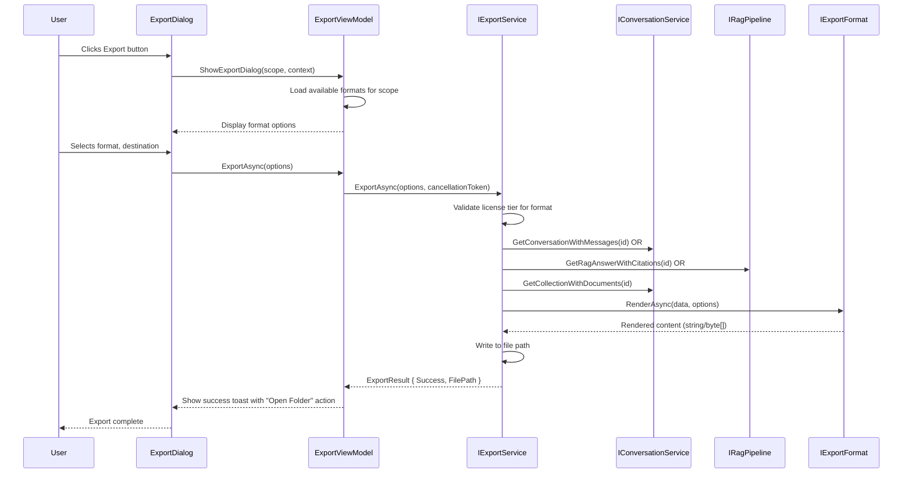
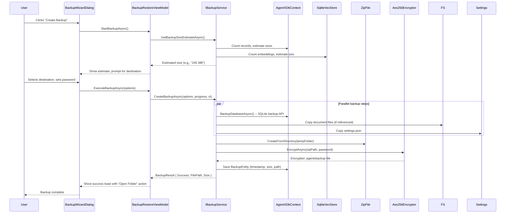

# Agent-X v1.1.0 Design Specification

**Version:** 1.1.0
**Date:** 2026-04-12
**Author:** Rocky Elsalaymeh / Strategia
**Status:** Draft → Review → Approved → In Progress → Complete

---

## Table of Contents

1. [Executive Summary](#1-executive-summary)
2. [Scope Overview](#2-scope-overview)
3. [Enhancement #1: Export & Share](#3-enhancement-1-export--share)
4. [Enhancement #5: Backup & Restore](#4-enhancement-5-backup--restore)
5. [Enhancement #12: System Tray + Global Hotkey](#5-enhancement-12-system-tray--global-hotkey)
6. [Database Schema Changes](#6-database-schema-changes)
7. [Security Considerations](#7-security-considerations)
8. [Test Strategy](#8-test-strategy)
9. [Implementation Tasks](#9-implementation-tasks)

---

## 1. Executive Summary

Agent-X v1.1.0 delivers three high-impact enhancements that close critical product gaps and transform user perception from "another AI chat app" to "indispensable Windows utility."

**Goals:**
- Enable users to get work product OUT of Agent-X in shareable, presentation-ready formats
- Protect user data with enterprise-grade backup/restore (table stakes for $249 price point)
- Make Agent-X feel like a native OS utility with system tray presence and global hotkey access

**Success Criteria:**
- Users can export conversations and RAG answers as PDF/Markdown/HTML with citations intact
- One-click backup creates encrypted archive; restore verifies integrity and recovers full state
- Win+Shift+A opens quick-chat overlay from anywhere on the desktop
- System tray icon shows connection status and provides quick actions

---

## 2. Scope Overview

### v1.1.0 Enhancements

| ID | Enhancement | Priority | License Gate | Effort | Files Changed (est.) |
|----|-------------|----------|--------------|--------|---------------------|
| #1 | Export & Share | Critical | Professional/Ultimate | Medium | 12-15 |
| #5 | Backup & Restore | Critical | All (scheduled: Pro+) | Medium | 10-12 |
| #12 | System Tray + Global Hotkey | High | All | Medium | 8-10 |

**Total:** ~30-37 new/modified files

### Out of Scope (v1.2.0+)

- Web Content Ingestion (v1.2.0)
- Conversation Branching (v1.2.0)
- Prompt Workflows/Chains (v1.2.0)
- Document Annotations (v1.2.0)
- Workspace Profiles (v1.3.0)
- Smart Inbox/Triage (v1.3.0)

---

## 3. Enhancement #1: Export & Share

### 3.1 Overview

Enable users to export conversations, RAG answers, and collections in portable, shareable formats. This closes the "data flows in but nothing comes out" gap.

### 3.2 Capabilities

| Export Type | Formats | License Gate |
|-------------|---------|--------------|
| Individual conversation | PDF, Markdown, HTML, JSON | Pro/Ultimate |
| RAG-cited answer | PDF, Markdown (with inline citations) | Pro/Ultimate |
| Collection bundle | ZIP (documents + metadata manifest) | Pro/Ultimate |
| Batch conversations | PDF (merged), Markdown (separate files in ZIP) | Pro/Ultimate |
| Single response | Copy to clipboard (Markdown/plain text) | All tiers |
| Full conversation history | JSON (archival/migration) | All tiers |

### 3.3 Architecture

```
AgentX.Core/Services/Export/
├── IExportService.cs           -- Main export orchestrator interface
├── ExportService.cs            -- Implementation
├── Formats/
│   ├── IExportFormat.cs        -- Format strategy interface
│   ├── MarkdownExport.cs       -- .md export with frontmatter
│   ├── HtmlExport.cs           -- .html with embedded CSS
│   ├── PdfExport.cs            -- QuestPDF-based PDF generation
│   └── JsonExport.cs           -- Raw JSON for archival
├── Models/
│   ├── ExportFormat.cs         -- Enum: Markdown, HTML, PDF, JSON, ZIP
│   ├── ExportOptions.cs        -- User-selected options
│   └── ExportResult.cs         -- Success/failure with file path
└── Templates/
    ├── ConversationTemplate.md -- Markdown template for conversations
    └── AnswerTemplate.md       -- Template for RAG answers with citations

AgentX.App/
├── Views/ExportDialog.xaml     -- Export format picker dialog
├── ViewModels/ExportViewModel.cs
├── Controls/ExportButton.xaml  -- Reusable export button (chat, search, collections)
└── Helpers/HtmlTemplate.cs     -- Embedded HTML/CSS template for HTML export
```

### 3.4 Export Flow



### 3.5 PDF Generation (QuestPDF)

**Package:** `QuestPDF` (MIT license, ~500KB, no native dependencies)

```csharp
// PdfExport.cs - Example PDF structure
public class PdfExport : IExportFormat
{
    public async Task<byte[]> RenderAsync(ExportData data, ExportOptions options)
    {
        return await Task.Run(() =>
        {
            var document = new ConversationDocument(data, options);
            return document.GeneratePdf();
        });
    }
}

// ConversationDocument.cs - QuestPDF document definition
public class ConversationDocument : IDocument
{
    private readonly ExportData _data;
    private readonly ExportOptions _options;

    public DocumentMetadata GetMetadata() => new()
    {
        Title = _data.Title,
        Author = "Agent-X",
        Subject = $"Conversation exported {_data.CreatedAt:yyyy-MM-dd}"
    };

    public void Compose(IDocumentContainer container)
    {
        container.Page(page =>
        {
            page.Size(PageSizes.A4);
            page.Margin(2, Unit.Centimetre);
            page.DefaultTextStyle(x => x.FontSize(11).FontFamily("Segoe UI"));

            page.Header().Element(c => BuildHeader(c));
            page.Content().Element(c => BuildConversationBody(c));
            page.Footer().Element(c => BuildFooter(c));
        });
    }
}
```

**Styling:**
- Header: Agent-X logo, conversation title, export date
- User messages: Light gray background (#F5F5F5), left-aligned
- Assistant messages: White, left-aligned, Markdown rendered
- Code blocks: Monospace font, dark background (#2D2D2D), syntax highlighting preserved
- Footer: Page numbers, "Exported from Agent-X v{version}"

### 3.6 License Gating

```csharp
// In ExportService.cs
public async Task<ExportResult> ExportAsync(ExportOptions options)
{
    var license = await _licenseService.GetCurrentTierAsync();

    // Copy-to-clipboard is always available
    if (options.Format == ExportFormat.Clipboard)
        return await ExportToClipboard(options);

    // JSON export (archival) is always available
    if (options.Format == ExportFormat.Json)
        return await ExportToJson(options);

    // PDF/Markdown/HTML require Professional or Ultimate
    if (license.Tier < LicenseTier.Professional)
    {
        return ExportResult.Failure("PDF/Markdown/HTML export requires Professional or Ultimate license.");
    }

    // ... proceed with export
}
```

### 3.7 UI Integration Points

| Location | Button/Action | Scope |
|----------|---------------|-------|
| ChatPage (top bar) | Export button | Current conversation |
| ChatPage (message bubble) | "Copy response" action | Single assistant message |
| AskFilesPage (top bar) | Export Answer button | Current RAG answer |
| SearchPage (results header) | Export Results button | Visible search results |
| CollectionManagerPage | Export Collection button | Selected collection |
| Command Palette | "Export Conversation" action | Prompts for selection |

---

## 4. Enhancement #5: Backup & Restore

### 4.1 Overview

Full encrypted backup of the entire Agent-X database and document store. For a local-first app charging up to $249, data safety is table-stakes.

### 4.2 Capabilities

| Feature | Description | License Gate |
|---------|-------------|--------------|
| One-click backup | Creates encrypted ZIP of entire data directory | All tiers |
| Choose destination | Local folder, external drive, network path | All tiers |
| Scheduled auto-backup | Daily/weekly with configurable retention | Professional+ |
| One-click restore | Restores from backup with integrity verification | All tiers |
| Backup history | Log of past backups with timestamps, sizes | All tiers |
| Backup size estimation | Shows estimated size before execution | All tiers |

### 4.3 Architecture

```
AgentX.Core/Services/Backup/
├── IBackupService.cs           -- Main backup orchestrator interface
├── BackupService.cs            -- Implementation
├── Encryption/
│   ├── Aes256Encryptor.cs      -- AES-256 encryption wrapper
│   └── KeyDerivation.cs        -- PBKDF2 key derivation from user password
├── Models/
│   ├── BackupEntity.cs         -- Database entity for backup history
│   ├── BackupInfo.cs           -- DTO for backup metadata
│   ├── BackupOptions.cs        -- User-selected options
│   └── BackupResult.cs         -- Success/failure with details
└── Scheduled/
    └── BackupScheduler.cs      -- Background hosted service for scheduled backups

AgentX.App/
├── Views/BackupRestorePage.xaml    -- Dedicated backup/restore settings page
├── ViewModels/BackupRestoreViewModel.cs
├── Views/BackupWizardDialog.xaml   -- Step-by-step backup wizard
├── Views/RestoreWizardDialog.xaml  -- Step-by-step restore wizard
└── Controls/BackupStatusCard.xaml  -- Dashboard card showing last backup status
```

### 4.4 Backup Flow



### 4.5 Backup File Format

```
.agentxbackup (encrypted ZIP container)
├── metadata.json           -- Backup metadata (version, timestamp, tier)
├── agentx.db              -- SQLite database (full backup via SQLite API)
├── settings.json          -- User settings
└── documents/             -- (Optional) copied referenced documents
    └── ...
```

**Encryption:**
- Algorithm: AES-256-CBC
- Key derivation: PBKDF2 with 100,000 iterations, random salt
- Salt stored in backup file header (unencrypted)
- Integrity check: HMAC-SHA256 of encrypted content

### 4.6 Scheduled Backup Implementation

```csharp
// BackupScheduler.cs - Background hosted service
public class BackupScheduler : IHostedService, IDisposable
{
    private readonly IServiceProvider _serviceProvider;
    private readonly ISettingsService _settingsService;
    private Timer? _timer;

    public async Task StartAsync(CancellationToken ct)
    {
        var settings = await _settingsService.GetSettingsAsync();

        if (settings.BackupEnabled && settings.BackupSchedule != BackupSchedule.Manual)
        {
            var dueTime = CalculateNextDueTime(settings.BackupSchedule, settings.BackupTime);
            var period = GetPeriod(settings.BackupSchedule);

            _timer = new Timer(ExecuteBackup, null, dueTime, period);
        }
    }

    private async void ExecuteBackup(object? state)
    {
        using var scope = _serviceProvider.CreateScope();
        var backupService = scope.ServiceProvider.GetRequiredService<IBackupService>();

        var settings = await _settingsService.GetSettingsAsync();
        var options = new BackupOptions
        {
            DestinationPath = settings.BackupDestinationPath,
            Password = settings.BackupPassword, // Or use DPAPI-derived key
            RetentionCount = settings.BackupRetentionCount
        };

        await backupService.CreateBackupAsync(options, _timer!.CancellationToken);
    }
}
```

### 4.7 Restore Flow

1. User selects `.agentxbackup` file
2. App prompts for password
3. Decrypts and verifies HMAC
4. Extracts to temp directory
5. Validates database schema version
6. Closes app, replaces `agentx.db` and `settings.json`
7. Restarts app with restored data

### 4.8 Database Entity

```csharp
// BackupEntity.cs
[Index(nameof(Path), IsUnique = true)]
public class BackupEntity
{
    public long Id { get; set; }
    public string Path { get; set; } = string.Empty;
    public long SizeBytes { get; set; }
    public string? PasswordHint { get; set; } // Optional user hint
    public BackupSource Source { get; set; } // Manual or Scheduled
    public bool IsEncrypted { get; set; }
    public DateTime CreatedAt { get; set; }
    public DateTime? LastVerifiedAt { get; set; }
    public string? ErrorMessage { get; set; }
}

public enum BackupSource { Manual, Scheduled }
```

---

## 5. Enhancement #12: System Tray + Global Hotkey

### 5.1 Overview

Minimize Agent-X to system tray with a global hotkey (Win+Shift+A) to instantly open a quick-chat overlay from anywhere on the desktop. Makes Agent-X feel like a native system utility.

### 5.2 Capabilities

| Feature | Description | License Gate |
|---------|-------------|--------------|
| Minimize to tray | Configurable: taskbar, tray, or both | All tiers |
| System tray icon | Context menu: Open, Quick Chat, New Conversation, Quit | All tiers |
| Global hotkey | Win+Shift+A (customizable) opens overlay | All tiers |
| Quick-chat overlay | Compact floating window with chat input + response | All tiers |
| Auto-hide on focus loss | Configurable timeout | All tiers |
| Tray tooltip | Shows active model and connection status | All tiers |
| Notification toasts | Indexing complete, digest ready, errors | All tiers |

### 5.3 Architecture

```
AgentX.App/
├── Services/
│   ├── ISystemTrayService.cs   -- Tray lifecycle interface
│   ├── SystemTrayService.cs    -- Implementation with NotifyIcon
│   ├── IGlobalHotkeyService.cs -- Hotkey registration interface
│   └── GlobalHotkeyService.cs  -- Win32 RegisterHotKey implementation
├── Views/
│   ├── QuickChatWindow.xaml    -- Compact overlay window
│   └── QuickChatViewModel.cs   -- ViewModel for quick chat
├── Controls/
│   └── TrayIcon.xaml           -- Embedded tray icon resource
└── Helpers/
    └── Win32Interop.cs         -- P/Invoke for RegisterHotKey, etc.

AgentX.Core/
└── (No changes - all UI-layer functionality)
```

### 5.4 Win32 Interop

```csharp
// Helpers/Win32Interop.cs
public static class Win32Interop
{
    // RegisterHotKey constants
    public const int MOD_WIN = 0x0008;
    public const int MOD_SHIFT = 0x0004;
    public const int MOD_CONTROL = 0x0002;
    public const int MOD_ALT = 0x0001;

    [DllImport("user32.dll", SetLastError = true)]
    [return: MarshalAs(UnmanagedType.Bool)]
    public static extern bool RegisterHotKey(IntPtr hWnd, int id, uint fsModifiers, uint vk);

    [DllImport("user32.dll", SetLastError = true)]
    [return: MarshalAs(UnmanagedType.Bool)]
    public static extern bool UnregisterHotKey(IntPtr hWnd, int id);

    [DllImport("user32.dll")]
    public static extern IntPtr GetMessageW(int nMaxCount);
}
```

### 5.5 Global Hotkey Registration

```csharp
// GlobalHotkeyService.cs
public class GlobalHotkeyService : IDisposable
{
    private const int HOTKEY_ID = 9000;
    private readonly HwndSource _source;
    private readonly Action _onHotkeyPressed;

    public GlobalHotkeyService(Action onHotkeyPressed)
    {
        _onHotkeyPressed = onHotkeyPressed;

        var source = new HwndSource(0, 0, 0, 0, 0, "AgentXHotkeyWindow", IntPtr.Zero);
        source.AddHook(WndProc);
        _source = source;

        RegisterHotKey(HOTKEY_ID);
    }

    private void RegisterHotKey(int id)
    {
        var modifiers = Win32Interop.MOD_WIN | Win32Interop.MOD_SHIFT;
        var vk = (uint)KeyInterop.VirtualKeyFromKey(Key.A);

        if (!Win32Interop.RegisterHotKey(_source.Handle, id, modifiers, vk))
        {
            _logger.Warning("Failed to register global hotkey. Error: {Error}", Marshal.GetLastWin32Error());
        }
    }

    private IntPtr WndProc(IntPtr hwnd, int msg, IntPtr wParam, IntPtr lParam, ref bool handled)
    {
        const int WM_HOTKEY = 0x0312;

        if (msg == WM_HOTKEY && wParam.ToInt32() == HOTKEY_ID)
        {
            _onHotkeyPressed();
            handled = true;
        }

        return IntPtr.Zero;
    }

    public void Dispose()
    {
        Win32Interop.UnregisterHotKey(_source.Handle, HOTKEY_ID);
        _source.RemoveHook(WndProc);
    }
}
```

### 5.6 System Tray Implementation

**Approach:** Use `Microsoft.Windows.AppNotifications` for modern Windows 11 tray integration, with `System.Windows.Forms.NotifyIcon` as fallback for Windows 10.

```csharp
// SystemTrayService.cs
public class SystemTrayService : ISystemTrayService
{
    private NotifyIcon? _notifyIcon;
    private readonly IServiceProvider _serviceProvider;
    private readonly ISettingsService _settingsService;

    public void Initialize()
    {
        _notifyIcon = new NotifyIcon
        {
            Icon = System.Drawing.Icon.ExtractAssociatedIcon(ApplicationPath),
            Text = "Agent-X - Connected (llama3.2)",
            Visible = true
        };

        _notifyIcon.ContextMenuStrip = CreateContextMenu();
        _notifyIcon.MouseClick += OnMouseClick;
    }

    private ContextMenuStrip CreateContextMenu()
    {
        var menu = new ContextMenuStrip();

        menu.Items.Add("Open Agent-X", null, (s, e) => OpenMainWindow());
        menu.Items.Add("Quick Chat", null, (s, e) => OpenQuickChat());
        menu.Items.Add(new ToolStripSeparator());
        menu.Items.Add("New Conversation", null, (s, e) => NewConversation());
        menu.Items.Add(new ToolStripSeparator());
        menu.Items.Add("Quit", null, (s, e) => Quit());

        return menu;
    }

    private void OnMouseClick(object? sender, MouseEventArgs e)
    {
        if (e.Button == MouseButtons.Left)
        {
            OpenMainWindow();
        }
        else if (e.Button == MouseButtons.Right)
        {
            _notifyIcon?.ContextMenuStrip?.Show(Cursor.Position);
        }
    }
}
```

### 5.7 Quick Chat Overlay

```xaml
<!-- QuickChatWindow.xaml -->
<Window
    x:Class="AgentX.App.Views.QuickChatWindow"
    xmlns="http://schemas.microsoft.com/winfx/2006/xaml/presentation"
    Title="Agent-X Quick Chat"
    Width="400"
    Height="500"
    WindowStyle="None"
    AllowsTransparency="True"
    Background="Transparent"
    Topmost="True"
    ShowInTaskbar="False"
    ResizeMode="NoResize">

    <Border
        Background="{ThemeResource ApplicationPageBackgroundThemeBrush}"
        BorderBrush="{ThemeResource CardStrokeColorDefault}"
        BorderThickness="1"
        CornerRadius="8">

        <Grid RowDefinitions="Auto,*,Auto">
            <!-- Header -->
            <Grid ColumnDefinitions="*,Auto" Padding="12,8">
                <TextBlock Text="Quick Chat" Style="{StaticResource CaptionTextBlockStyle}" />
                <Button x:Name="CloseButton" Content="&#xE711;" Width="30" Height="30"
                        Click="CloseButton_Click" Style="{StaticResource IconButtonStyle}"/>
            </Grid>

            <!-- Chat Messages -->
            <ScrollViewer Grid.Row="1" Padding="12">
                <ItemsControl ItemsSource="{x:Bind ViewModel.Messages}" />
            </ScrollViewer>

            <!-- Input -->
            <Grid Grid.Row="2" ColumnDefinitions="*,Auto" Padding="12" Margin="0,8,0,0">
                <TextBox x:Name="InputTextBox" PlaceholderText="Type a message..."
                         KeyDown="InputTextBox_KeyDown" />
                <Button x:Name="SendButton" Content="Send" Grid.Column="1" Margin="8,0,0,0"
                        Click="SendButton_Click" />
            </Grid>
        </Grid>
    </Border>
</Window>
```

### 5.8 Settings Integration

New "System" section in Settings page:

| Setting | Type | Default | Notes |
|---------|------|---------|-------|
| Minimize to | ComboBox | Taskbar | Options: Taskbar, System tray, Both |
| Global hotkey | HotkeyPicker | Win+Shift+A | Customizable key combination |
| Quick Chat auto-hide | Toggle | On | Hide overlay on focus loss |
| Show notifications | Toggle | On | Toast notifications from tray |

---

## 6. Database Schema Changes

### 6.1 New Tables

```sql
-- Backup history tracking
CREATE TABLE IF NOT EXISTS backups (
    id              INTEGER PRIMARY KEY AUTOINCREMENT,
    path            TEXT NOT NULL UNIQUE,
    size_bytes      INTEGER NOT NULL,
    password_hint   TEXT,
    source          TEXT NOT NULL CHECK(source IN ('manual', 'scheduled')),
    is_encrypted    INTEGER NOT NULL DEFAULT 1,
    created_at      DATETIME NOT NULL DEFAULT CURRENT_TIMESTAMP,
    last_verified_at DATETIME,
    error_message   TEXT
);

CREATE INDEX IF NOT EXISTS idx_backups_created ON backups(created_at DESC);

-- Export history (optional, for analytics)
CREATE TABLE IF NOT EXISTS export_history (
    id              INTEGER PRIMARY KEY AUTOINCREMENT,
    scope_type      TEXT NOT NULL CHECK(scope_type IN ('conversation', 'answer', 'collection', 'search')),
    scope_id        INTEGER,
    format          TEXT NOT NULL,
    file_path       TEXT,
    file_size_bytes INTEGER,
    exported_at     DATETIME NOT NULL DEFAULT CURRENT_TIMESTAMP
);
```

### 6.2 EF Core Migrations

```csharp
// Migration: 20260412_AddBackupAndExportTables.cs
public partial class AddBackupAndExportTables : Migration
{
    protected override void Up(MigrationBuilder migrationBuilder)
    {
        migrationBuilder.CreateTable(
            name: "backups",
            columns: table => new
            {
                Id = table.Column<long>(type: "INTEGER", nullable: false)
                    .Annotation("Sqlite:Autoincrement", true),
                Path = table.Column<string>(type: "TEXT", nullable: false),
                SizeBytes = table.Column<long>(type: "INTEGER", nullable: false),
                PasswordHint = table.Column<string>(type: "TEXT", nullable: true),
                Source = table.Column<string>(type: "TEXT", nullable: false),
                IsEncrypted = table.Column<bool>(type: "INTEGER", nullable: false),
                CreatedAt = table.Column<DateTime>(type: "TEXT", nullable: false),
                LastVerifiedAt = table.Column<DateTime>(type: "TEXT", nullable: true),
                ErrorMessage = table.Column<string>(type: "TEXT", nullable: true)
            });

        migrationBuilder.CreateIndex(
            name: "IX_backups_created_at",
            table: "backups",
            column: "created_at",
            descending: true);

        migrationBuilder.CreateTable(
            name: "export_history",
            columns: table => new { ... });
    }
}
```

---

## 7. Security Considerations

### 7.1 Backup Encryption

- **Algorithm:** AES-256-CBC (industry standard for file encryption)
- **Key derivation:** PBKDF2 with 100,000 iterations (OWASP recommendation)
- **Salt:** 16-byte random salt, stored in backup file header
- **Integrity:** HMAC-SHA256 of encrypted content

### 7.2 Password Storage

**Option A (Recommended):** User-provided password per backup
- Password never stored
- Optional hint stored in `BackupEntity.PasswordHint`
- User responsible for remembering

**Option B:** DPAPI-derived key (Windows-only)
- Key derived from user's Windows credentials
- No password prompt, seamless backup/restore
- Tied to user account (can't restore on different machine)

### 7.3 Global Hotkey Security

- Hotkey registration failure is non-fatal (logged, app continues)
- Hotkey ID (9000) is arbitrary but should be unique to avoid conflicts
- WndProc handler validates `wParam` before invoking callback

### 7.4 Export Security

- Exported files are NOT encrypted (user shares intentionally)
- PDF exports should include "Exported from Agent-X" watermark
- JSON export includes warning comment about sensitive data

---

## 8. Test Strategy

### 8.1 Unit Tests (AgentX.Tests)

| Service | Test Coverage |
|---------|---------------|
| `ExportService` | Format validation, license gating, template rendering |
| `BackupService` | Backup creation, encryption, restore verification |
| `Aes256Encryptor` | Encrypt/decrypt roundtrip, key derivation |
| `GlobalHotkeyService` | Registration/unregistration (mocked HwndSource) |
| `SystemTrayService` | Context menu creation, click handling |

### 8.2 Integration Tests

- Export conversation → verify file exists → parse output → validate structure
- Create backup → delete database → restore → verify data integrity
- Register hotkey → simulate WM_HOTKEY → verify callback invoked

### 8.3 Manual Test Procedures

1. **Export Test:**
   - Create conversation with code blocks, citations
   - Export as PDF, Markdown, HTML
   - Verify formatting preserved in all formats

2. **Backup/Restore Test:**
   - Populate database with test data
   - Create encrypted backup
   - Delete `agentx.db`
   - Restore from backup
   - Verify all data recovered

3. **System Tray Test:**
   - Minimize to tray
   - Click tray icon → verify window restores
   - Right-click → verify context menu
   - Press global hotkey → verify Quick Chat opens

---

## 9. Implementation Tasks

### Task 1.1: Export Service Core

**Files:**
- `src/AgentX.Core/Services/Export/IExportService.cs`
- `src/AgentX.Core/Services/Export/ExportService.cs`
- `src/AgentX.Core/Services/Export/Formats/IExportFormat.cs`
- `src/AgentX.Core/Services/Export/Formats/MarkdownExport.cs`
- `src/AgentX.Core/Services/Export/Formats/JsonExport.cs`
- `src/AgentX.Core/Services/Export/Models/*.cs`

**Tests:**
- `tests/AgentX.Tests/Services/Export/ExportServiceTests.cs`

---

### Task 1.2: PDF Export (QuestPDF)

**Files:**
- `src/AgentX.Core/Services/Export/Formats/PdfExport.cs`
- `src/AgentX.Core/Services/Export/Templates/*.cs`

**Dependencies:**
- Add `QuestPDF` NuGet package to `AgentX.Core.csproj`

**Tests:**
- `tests/AgentX.Tests/Services/Export/PdfExportTests.cs`

---

### Task 1.3: Export UI Integration

**Files:**
- `src/AgentX.App/Views/ExportDialog.xaml`
- `src/AgentX.App/ViewModels/ExportViewModel.cs`
- `src/AgentX.App/Controls/ExportButton.xaml`
- Update: `ChatPage.xaml`, `AskFilesPage.xaml`, `CollectionManagerPage.xaml`

---

### Task 2.1: Backup Service Core

**Files:**
- `src/AgentX.Core/Services/Backup/IBackupService.cs`
- `src/AgentX.Core/Services/Backup/BackupService.cs`
- `src/AgentX.Core/Services/Backup/Encryption/Aes256Encryptor.cs`
- `src/AgentX.Core/Services/Backup/Encryption/KeyDerivation.cs`
- `src/AgentX.Core/Data/Entities/BackupEntity.cs`
- `src/AgentX.Core/Services/Backup/Scheduled/BackupScheduler.cs`

**Tests:**
- `tests/AgentX.Tests/Services/Backup/BackupServiceTests.cs`
- `tests/AgentX.Tests/Services/Backup/Aes256EncryptorTests.cs`

---

### Task 2.2: Backup UI

**Files:**
- `src/AgentX.App/Views/BackupRestorePage.xaml`
- `src/AgentX.App/ViewModels/BackupRestoreViewModel.cs`
- `src/AgentX.App/Views/BackupWizardDialog.xaml`
- `src/AgentX.App/Views/RestoreWizardDialog.xaml`
- `src/AgentX.App/Controls/BackupStatusCard.xaml`

---

### Task 3.1: System Tray Service

**Files:**
- `src/AgentX.App/Services/ISystemTrayService.cs`
- `src/AgentX.App/Services/SystemTrayService.cs`
- `src/AgentX.App/Helpers/Win32Interop.cs`

**Tests:**
- `tests/AgentX.Tests/Services/SystemTrayServiceTests.cs` (mocked)

---

### Task 3.2: Global Hotkey Service

**Files:**
- `src/AgentX.App/Services/IGlobalHotkeyService.cs`
- `src/AgentX.App/Services/GlobalHotkeyService.cs`

**Tests:**
- `tests/AgentX.Tests/Services/GlobalHotkeyServiceTests.cs` (mocked HwndSource)

---

### Task 3.3: Quick Chat Overlay

**Files:**
- `src/AgentX.App/Views/QuickChatWindow.xaml`
- `src/AgentX.App/ViewModels/QuickChatViewModel.cs`
- Update: `MainWindow.xaml.cs` (minimize handling)
- Update: `SettingsPage.xaml` (new "System" section)

---

### Task 4: Database Migration

**Files:**
- `src/AgentX.Core/Data/Migrations/20260412_AddBackupAndExportTables.cs`
- Update: `AgentXDbContext.cs` (add `DbSet<BackupEntity>`)

---

### Task 5: Documentation

**Files:**
- Update: `docs/USER-GUIDE.md` (Export, Backup, System Tray sections)
- Update: `docs/API-REFERENCE.md` (new services)
- Create: `docs/v1.1.0-RELEASE-NOTES.md`

---

## 10. Version History

| Version | Date | Status |
|---------|------|--------|
| 1.0 (initial) | 2026-02-27 | Complete |
| 1.1.0 (draft) | 2026-04-12 | In Review |

---

*End of v1.1.0 Design Specification*
