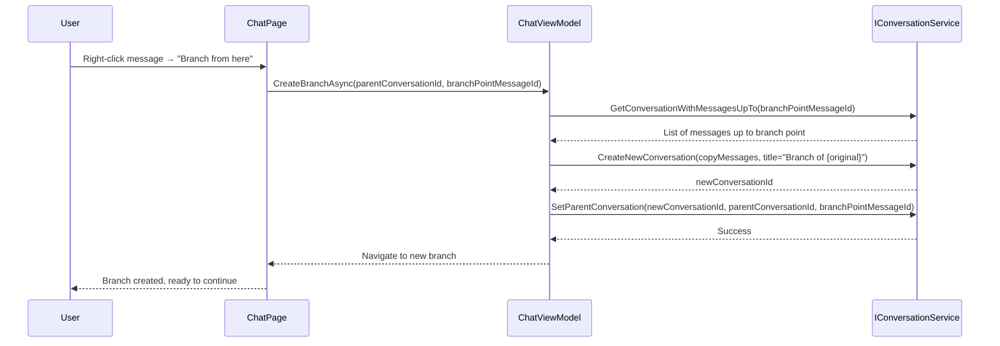

# Agent-X v1.2.0 Design Specification

**Version:** 1.2.0
**Date:** 2026-04-12
**Author:** Rocky Elsalaymeh / Strategia
**Status:** Draft → Review → Approved → In Progress → Complete

---

## Table of Contents

1. [Executive Summary](#1-executive-summary)
2. [Scope Overview](#2-scope-overview)
3. [Enhancement #3: Web Content Ingestion](#3-enhancement-3-web-content-ingestion)
4. [Enhancement #4: Conversation Branching](#4-enhancement-4-conversation-branching--forking)
5. [Enhancement #2: Prompt Workflows / Chains](#5-enhancement-2-prompt-workflows--chains)
6. [Enhancement #7: Document Annotations & Highlights](#6-enhancement-7-document-annotations--highlights)
7. [Enhancement #8: Multi-Language UI Support](#7-enhancement-8-multi-language-ui-support)
8. [Database Schema Changes](#8-database-schema-changes)
9. [Test Strategy](#9-test-strategy)
10. [Implementation Tasks](#10-implementation-tasks)

---

## 1. Executive Summary

Agent-X v1.2.0 builds on v1.1.0's foundation (export, backup, system tray) by adding **intelligent input** and **deeper conversation capabilities**. This version transforms Agent-X from a document Q&A tool into a **dynamic thinking partner**.

**Goals:**
- Ingest web content directly (URLs, YouTube transcripts) — no manual copy-paste
- Branch conversations to explore alternate AI responses without losing original threads
- Create multi-step AI workflows that chain prompts together
- Add inline annotations/highlights that AI can reference in RAG responses
- Support 6 UI languages for international market access

**Success Criteria:**
- Users can paste a URL and have clean article text indexed in seconds
- Conversation tree view shows branches; switching branches is instant
- Workflow builder creates reusable prompt chains with visual editor
- Highlighted passages appear in RAG context with special markers
- UI fully localized for en-US, es, de, fr, ja, zh-CN

---

## 2. Scope Overview

### v1.2.0 Enhancements

| ID | Enhancement | Priority | License Gate | Effort | Files Changed (est.) |
|----|-------------|----------|--------------|--------|---------------------|
| #3 | Web Content Ingestion | High | Starter+ | Medium | 8-10 |
| #4 | Conversation Branching | High | Pro/Ultimate | High | 12-15 |
| #2 | Prompt Workflows/Chains | Critical | Ultimate | High | 18-22 |
| #7 | Document Annotations | Medium | Pro/Ultimate | High | 14-18 |
| #8 | Multi-Language UI | Medium | All | Medium | 20-25 (mostly .resw) |

**Total:** ~72-90 new/modified files

### Dependencies on v1.1.0

- **Export:** Workflows export their output; annotations can be exported
- **Backup:** All new entities (workflows, annotations, branches) included in backup
- **System Tray:** No direct dependency

### Out of Scope (v1.3.0+)

- Workspace Profiles (multi-DB architecture)
- Smart Inbox/Triage (watch folder workflow)
- Comparative Analysis Mode
- Voice Input & Audio Transcription
- Plugin API

---

## 3. Enhancement #3: Web Content Ingestion

### 3.1 Overview

Allow users to paste a URL and ingest web article content directly into the Knowledge Vault. Removes the biggest friction point in building a knowledge base — users no longer need to manually copy-paste or download web content.

### 3.2 Capabilities

| Feature | Description | License Gate |
|---------|-------------|--------------|
| URL Import | Paste URL → extract article text, title, author, date | Starter+ |
| Readability Cleanup | Remove ads, navigation, scripts | Starter+ |
| YouTube Transcript | Extract transcript via API | Starter+ |
| Source Metadata | URL preserved on DocumentEntity | Starter+ |
| Batch URL Import | Multiple URLs (one per line) | Starter+ |
| Rate Limiting | Respect robots.txt, 1s delay between requests | All |

### 3.3 Architecture

```
AgentX.Core/
├── Documents/
│   └── Processors/
│       └── WebProcessor.cs       -- URL → text extraction
├── Services/
│   └── Web/
│       ├── IWebScraperService.cs
│       ├── WebScraperService.cs  -- HTTP client + HTML parsing
│       ├── ReadabilityExtractor.cs -- Article content extraction
│       └── YouTubeTranscriptService.cs
└── Data/
    └── Entities/
        └── DocumentEntity.cs     -- Add SourceUrl property

AgentX.App/
├── Views/
│   └── UrlImportDialog.xaml      -- URL input with validation
└── ViewModels/
    └── UrlImportViewModel.cs
```

### 3.4 Implementation Details

**Package:** `HtmlAgilityPack` (MIT, already common in .NET)

```csharp
// ReadabilityExtractor.cs - Simplified article extraction
public class ReadabilityExtractor
{
    public Article Extract(string html)
    {
        var doc = new HtmlDocument();
        doc.LoadHtml(html);

        // Remove unwanted elements
        doc.DocumentNode.SelectNodes("//script")?.ForEach(n => n.Remove());
        doc.DocumentNode.SelectNodes("//style")?.ForEach(n => n.Remove());
        doc.DocumentNode.SelectNodes("//nav")?.ForEach(n => n.Remove());
        doc.DocumentNode.SelectNodes("//footer")?.ForEach(n => n.Remove());

        // Find main content (simplified readability heuristic)
        var articleNode = doc.DocumentNode.SelectSingleNode("//article")
            ?? doc.DocumentNode.SelectSingleNode("//main")
            ?? doc.DocumentNode.SelectSingleNode("//*[@class='content']")
            ?? doc.DocumentNode.SelectSingleNode("//div[contains(@class, 'article')]");

        return new Article
        {
            Title = ExtractTitle(doc),
            Content = articleNode?.InnerText ?? "",
            Author = ExtractAuthor(doc),
            PublishedDate = ExtractDate(doc),
            WordCount = CountWords(articleNode?.InnerText ?? "")
        };
    }
}
```

**YouTube Transcript:**
- Use `https://www.youtube.com/watch?v={videoId}` HTML parsing
- Extract `playerResponse` JSON from inline script
- Parse `captions.playerCaptionsTracklistRenderer` for transcript

---

## 4. Enhancement #4: Conversation Branching & Forking

### 4.1 Overview

Allow users to branch a conversation at any message to explore alternate AI responses without losing the original thread. Creates a tree-structured conversation model.

### 4.2 Capabilities

| Feature | Description | License Gate |
|---------|-------------|--------------|
| Branch from Message | Right-click → "Branch from here" | Pro/Ultimate |
| Tree View | Conversation sidebar shows indented children | Pro/Ultimate |
| Branch Switching | Click any branch to load that thread | Pro/Ultimate |
| Branch Naming | Rename branches for clarity | Pro/Ultimate |
| Merge Insights | Copy messages from branch back to main | Pro/Ultimate |
| Branch Indicator | Visual marker on messages with children | Pro/Ultimate |
| Delete Branch | Remove branch without affecting siblings | Pro/Ultimate |

### 4.3 Database Changes

```csharp
// ConversationEntity.cs - Add branching fields
[Index(nameof(ParentConversationId))]
[Index(nameof(BranchPointMessageId))]
public class ConversationEntity
{
    // ... existing fields ...

    // Branching support
    public long? ParentConversationId { get; set; }
    public long? BranchPointMessageId { get; set; }

    // Navigation properties
    [ForeignKey(nameof(ParentConversationId))]
    public ConversationEntity? ParentConversation { get; set; }

    [InverseProperty(nameof(ParentConversation))]
    public virtual ICollection<ConversationEntity> Branches { get; set; } = new List<ConversationEntity>();
}
```

### 4.4 Branch Creation Flow



### 4.5 Tree View Implementation

```xaml
<!-- Conversation sidebar with tree rendering -->
<TreeView
    x:Name="ConversationTreeView"
    ItemsSource="{x:Bind ViewModel.ConversationRoots}"
    SelectionChanged="OnConversationSelected">

    <TreeView.ItemTemplate>
        <x:Bind ViewModel.ConversationNodeTemplate>
            <StackPanel Orientation="Horizontal">
                <FontIcon
                    Glyph="&#xE8A5;"
                    FontSize="12"
                    Visibility="{x:Bind HasBranches, Converter={StaticResource BoolToVisibilityConverter}}" />
                <TextBlock Text="{x:Bind Conversation.Title}" />
            </StackPanel>
        </x:Bind>
    </TreeView.ItemTemplate>
</TreeView>
```

---

## 5. Enhancement #2: Prompt Workflows / Chains

### 5.1 Overview

Let users define multi-step AI pipelines that chain prompts together. Each step's output feeds into the next step's input, enabling complex workflows like "Summarize → Extract key points → Generate action items → Draft email."

### 5.2 Capabilities

| Feature | Description | License Gate |
|---------|-------------|--------------|
| Visual Workflow Builder | Drag-and-drop step cards | Ultimate |
| Pre-built Templates | Summarize & Act, Research Brief, Document Review | Ultimate |
| Step Types | AI Prompt, Document Lookup (RAG), Text Transform, Conditional Branch, Output Format | Ultimate |
| Save & Reuse | Named workflows in Quick Actions | Ultimate |
| Per-Step Model Selection | Fast model for extraction, powerful for generation | Ultimate |
| Execution Log | Shows each step's input/output | Ultimate |
| Import/Export | JSON workflow definitions | Ultimate |

### 5.3 Architecture

```
AgentX.Core/
├── Services/
│   └── Workflows/
│       ├── IWorkflowService.cs
│       ├── WorkflowService.cs
│       ├── WorkflowEngine.cs      -- Execution engine
│       └── Steps/
│           ├── IWorkflowStep.cs   -- Step interface
│           ├── PromptStep.cs      -- AI prompt
│           ├── RagLookupStep.cs   -- Document lookup
│           ├── TransformStep.cs   -- Text manipulation
│           └── BranchStep.cs      -- Conditional logic
├── Data/
│   └── Entities/
│       ├── WorkflowEntity.cs
│       └── WorkflowStepEntity.cs

AgentX.App/
├── Views/
│   ├── WorkflowBuilderPage.xaml
│   ├── WorkflowRunnerPage.xaml
│   └── Controls/
│       ├── WorkflowStepCard.xaml
│       └── WorkflowCanvas.xaml
└── ViewModels/
    ├── WorkflowBuilderViewModel.cs
    └── WorkflowRunnerViewModel.cs
```

### 5.4 Workflow Entity Model

```csharp
public class WorkflowEntity
{
    public long Id { get; set; }
    public string Name { get; set; } = "";
    public string Description { get; set; } = "";
    public string Category { get; set; } = "Custom";
    public string? JsonDefinition { get; set; } // Serialized workflow graph
    public bool IsTemplate { get; set; }
    public DateTime CreatedAt { get; set; }
    public DateTime UpdatedAt { get; set; }

    // Navigation
    public virtual ICollection<WorkflowStepEntity> Steps { get; set; } = new List<WorkflowStepEntity>();
}

public class WorkflowStepEntity
{
    public long Id { get; set; }
    public long WorkflowId { get; set; }
    public int StepOrder { get; set; }
    public StepType Type { get; set; }
    public string PromptTemplate { get; set; } = "";
    public string? ModelId { get; set; } // Override workflow default
    public string? InputMapping { get; set; } // JSON path to previous step output
    public string? OutputVariable { get; set; } // Name for downstream reference

    public virtual WorkflowEntity Workflow { get; set; } = null!;
}

public enum StepType
{
    Prompt,
    RagLookup,
    Transform,
    Branch,
    OutputFormat
}
```

### 5.5 Workflow Execution

```csharp
// WorkflowEngine.cs
public class WorkflowEngine
{
    private readonly IServiceProvider _serviceProvider;
    private readonly Dictionary<StepType, IWorkflowStepExecutor> _executors;

    public async Task<WorkflowExecutionResult> ExecuteAsync(
        WorkflowEntity workflow,
        WorkflowExecutionContext context,
        IProgress<StepProgress>? progress = null,
        CancellationToken ct = default)
    {
        var results = new Dictionary<string, object>();

        foreach (var step in workflow.Steps.OrderBy(s => s.StepOrder))
        {
            var executor = _executors[step.Type];
            var input = ResolveInput(step, results);

            var stepResult = await executor.ExecuteAsync(step, input, context, ct);

            results[step.OutputVariable ?? $"step_{step.Id}"] = stepResult;

            progress?.Report(new StepProgress { Step = step, Completed = true, Result = stepResult });
        }

        return new WorkflowExecutionResult { Outputs = results };
    }
}
```

### 5.6 Pre-built Templates

| Template | Steps | Use Case |
|----------|-------|----------|
| Summarize & Act | 1. Summarize doc → 2. Extract action items → 3. Draft email | Quick meeting notes |
| Research Brief | 1. RAG lookup → 2. Compare sources → 3. Generate brief | Competitive analysis |
| Document Review | 1. Extract claims → 2. Check against knowledge → 3. Flag contradictions | Legal/contract review |
| Content Repurpose | 1. Summarize blog → 2. Generate social posts → 3. Create outline | Marketing content |

---

## 6. Enhancement #7: Document Annotations & Highlights

### 6.1 Overview

Allow users to add inline highlights and notes on indexed documents. AI can reference user annotations in RAG responses. Turns Agent-X from a search tool into a **thinking tool**.

### 6.2 Capabilities

| Feature | Description | License Gate |
|---------|-------------|--------------|
| Text Highlighting | Select text → highlight with color | Pro/Ultimate |
| Color Coding | Yellow, green, blue, red, purple | Pro/Ultimate |
| Notes/Comments | Add notes attached to highlights | Pro/Ultimate |
| Annotation Search | "Show me my highlights on [topic]" | Pro/Ultimate |
| Annotations Panel | Browse all highlights across documents | Pro/Ultimate |
| Export Annotations | Markdown summary of highlights | Pro/Ultimate |
| Annotation Counts | Shown on document cards | All |

### 6.3 Database Schema

```csharp
[Index(nameof(DocumentId))]
[Index(nameof(Color))]
public class AnnotationEntity
{
    public long Id { get; set; }
    public long DocumentId { get; set; }
    public int StartCharOffset { get; set; }
    public int EndCharOffset { get; set; }
    public string HighlightedText { get; set; } = "";
    public string? NoteText { get; set; }
    public string Color { get; set; } = "yellow"; // yellow, green, blue, red, purple
    public DateTime CreatedAt { get; set; }
    public DateTime? UpdatedAt { get; set; }

    // Navigation
    public virtual DocumentEntity Document { get; set; } = null!;
}
```

### 6.4 Annotation Service

```csharp
// IAnnotationService.cs
public interface IAnnotationService
{
    Task<AnnotationEntity> CreateAnnotationAsync(long documentId, int startOffset, int endOffset, string color, string? note);
    Task<AnnotationEntity> UpdateAnnotationAsync(long annotationId, string? noteText, string? color);
    Task DeleteAnnotationAsync(long annotationId);
    Task<IReadOnlyList<AnnotationEntity>> GetAnnotationsByDocumentAsync(long documentId);
    Task<IReadOnlyList<AnnotationEntity>> GetAnnotationsByColorAsync(string color);
    Task<IReadOnlyList<AnnotationEntity>> SearchAnnotationsAsync(string query);
    Task<AnnotationExportResult> ExportAnnotationsAsync(long documentId, ExportFormat format);
}
```

### 6.5 RAG Integration

Annotations are indexed in the vector store with a special prefix:

```csharp
// In AnnotationService.CreateAnnotationAsync
var annotationText = $"[ANNOTATION:{color}] {highlightedText} - {noteText}";
var embedding = await _embeddingService.GenerateEmbeddingAsync(annotationText);
await _vectorStore.InsertAnnotationEmbeddingAsync(documentId, annotationId, embedding);
```

RAG pipeline boosts annotated chunks:

```csharp
// In SemanticSearchService.SearchAsync
var results = await _vectorStore.SearchAsync(queryVector, topK, minSimilarity);

// Boost annotated chunks by 10%
foreach (var result in results)
{
    if (result.HasAnnotation)
    {
        result.Score *= 1.10;
    }
}
```

### 6.6 UI Implementation

```xaml
<!-- Document preview with annotation support -->
<RichTextBlock
    x:Name="DocumentContentBlock"
    SelectionChanged="OnTextSelectionChanged">

    <RichTextBlock.ContextFlyout>
        <MenuFlyout>
            <MenuFlyoutItem
                Text="Highlight Yellow"
                Icon="Highlight"
                Click="OnHighlightClicked">
                <MenuFlyoutItem.Tag>yellow</MenuFlyoutItem.Tag>
            </MenuFlyoutItem>
            <!-- Repeat for other colors -->
            <MenuFlyoutSeparator />
            <MenuFlyoutItem
                Text="Add Note"
                Icon="Comment"
                Click="OnAddNoteClicked" />
        </MenuFlyout>
    </RichTextBlock.ContextFlyout>
</RichTextBlock>
```

---

## 7. Enhancement #8: Multi-Language UI Support

### 7.1 Overview

UI localization framework enabling the app to be used in multiple languages. Opens international markets — the local-first privacy angle resonates strongly in EU and Asia markets.

### 7.2 Supported Languages

| Code | Language | Native Name |
|------|----------|-------------|
| `en-US` | English (default) | English |
| `es` | Spanish | Español |
| `de` | German | Deutsch |
| `fr` | French | Français |
| `ja` | Japanese | 日本語 |
| `zh-CN` | Chinese (Simplified) | 简体中文 |

### 7.3 Implementation Approach

**WinUI 3 x:Uid with .resw files**

```
AgentX.App/
├── Strings/
│   ├── en-US/
│   │   └── Resources.resw
│   ├── es/
│   │   └── Resources.resw
│   ├── de/
│   │   └── Resources.resw
│   ├── fr/
│   │   └── Resources.resw
│   ├── ja/
│   │   └── Resources.resw
│   └── zh-CN/
│       └── Resources.resw
└── Helpers/
    └── LocalizationService.cs
```

### 7.4 XAML Binding

```xaml
<!-- Before localization -->
<TextBlock Text="Knowledge Vault" />
<Button Content="Import Files" />

<!-- After localization -->
<TextBlock x:Uid="KnowledgeVault_Title" />
<Button x:Uid="ImportFiles_Button" />
```

```xml
<!-- Strings/en-US/Resources.resw -->
<data name="KnowledgeVault_Title">
  <value>Knowledge Vault</value>
</data>
<data name="ImportFiles_Button">
  <value>Import Files</value>
</data>

<!-- Strings/es/Resources.resw -->
<data name="KnowledgeVault_Title">
  <value>Biblioteca de Conocimiento</value>
</data>
<data name="ImportFiles_Button">
  <value>Importar Archivos</value>
</data>
```

### 7.5 Runtime Language Switching

```csharp
// LocalizationService.cs
public class LocalizationService
{
    private readonly ISettingsService _settingsService;

    public async Task SetLanguageAsync(string languageCode)
    {
        var settings = await _settingsService.GetSettingsAsync();
        settings.UILanguage = languageCode;
        await _settingsService.SaveSettingsAsync(settings);

        // Apply to current session
        var resourceContext = ResourceManager.Current.MainContext;
        resourceContext.OverrideQualifier("Language", languageCode);
    }

    public string GetString(string key)
    {
        return ResourceManager.MainResourceMap.GetValue($"Strings/{key}").ValueAsString;
    }
}
```

### 7.6 Settings Integration

New "Language" dropdown in Settings → Appearance:

```xaml
<ComboBox
    x:Uid="LanguageSelector"
    SelectedItem="{x:Bind ViewModel.SelectedLanguage, Mode=TwoWay}"
    SelectionChanged="OnLanguageChanged">
    <ComboBoxItem Content="English" Tag="en-US" />
    <ComboBoxItem Content="Español" Tag="es" />
    <ComboBoxItem Content="Deutsch" Tag="de" />
    <ComboBoxItem Content="Français" Tag="fr" />
    <ComboBoxItem Content="日本語" Tag="ja" />
    <ComboBoxItem Content="简体中文" Tag="zh-CN" />
</ComboBox>
```

### 7.7 AI Prompt Language Hint

System prompts include user's UI language preference:

```csharp
// In SystemPromptService
var languageHint = settings.UILanguage switch
{
    "es" => "Respond in Spanish.",
    "de" => "Antworten Sie auf Deutsch.",
    "fr" => "Répondez en français.",
    "ja" => "日本語で回答してください。",
    "zh-CN" => "请用中文回答。",
    _ => "Respond in English."
};

systemPrompt += $"\n\n{languageHint}";
```

---

## 8. Database Schema Changes

### 8.1 New Tables

```sql
-- Conversation branching
ALTER TABLE conversations ADD COLUMN parent_conversation_id INTEGER;
ALTER TABLE conversations ADD COLUMN branch_point_message_id INTEGER;

CREATE INDEX IF NOT EXISTS idx_conversations_parent ON conversations(parent_conversation_id);
CREATE INDEX IF NOT EXISTS idx_conversations_branch_point ON conversations(branch_point_message_id);

-- Workflows
CREATE TABLE IF NOT EXISTS workflows (
    id              INTEGER PRIMARY KEY AUTOINCREMENT,
    name            TEXT NOT NULL,
    description     TEXT,
    category        TEXT NOT NULL DEFAULT 'Custom',
    json_definition TEXT,
    is_template     INTEGER NOT NULL DEFAULT 0,
    created_at      DATETIME NOT NULL DEFAULT CURRENT_TIMESTAMP,
    updated_at      DATETIME NOT NULL DEFAULT CURRENT_TIMESTAMP
);

CREATE TABLE IF NOT EXISTS workflow_steps (
    id              INTEGER PRIMARY KEY AUTOINCREMENT,
    workflow_id     INTEGER NOT NULL,
    step_order      INTEGER NOT NULL,
    type            TEXT NOT NULL CHECK(type IN ('prompt', 'rag_lookup', 'transform', 'branch', 'output_format')),
    prompt_template TEXT,
    model_id        TEXT,
    input_mapping   TEXT,
    output_variable TEXT,
    FOREIGN KEY (workflow_id) REFERENCES workflows(id) ON DELETE CASCADE
);

CREATE INDEX IF NOT EXISTS idx_workflow_steps_workflow ON workflow_steps(workflow_id);

-- Document annotations
CREATE TABLE IF NOT EXISTS annotations (
    id              INTEGER PRIMARY KEY AUTOINCREMENT,
    document_id     INTEGER NOT NULL,
    start_offset    INTEGER NOT NULL,
    end_offset      INTEGER NOT NULL,
    highlighted_text TEXT NOT NULL,
    note_text       TEXT,
    color           TEXT NOT NULL DEFAULT 'yellow' CHECK(color IN ('yellow', 'green', 'blue', 'red', 'purple')),
    created_at      DATETIME NOT NULL DEFAULT CURRENT_TIMESTAMP,
    updated_at      DATETIME,
    FOREIGN KEY (document_id) REFERENCES documents(id) ON DELETE CASCADE
);

CREATE INDEX IF NOT EXISTS idx_annotations_document ON annotations(document_id);
CREATE INDEX IF NOT EXISTS idx_annotations_color ON annotations(color);

-- Document URL source
ALTER TABLE documents ADD COLUMN source_url TEXT;
CREATE INDEX IF NOT EXISTS idx_documents_source_url ON documents(source_url);
```

---

## 9. Test Strategy

### 9.1 Unit Tests

| Service | Test Coverage |
|---------|---------------|
| `WebScraperService` | URL validation, HTML parsing, error handling |
| `ReadabilityExtractor` | Content extraction accuracy |
| `YouTubeTranscriptService` | Transcript parsing |
| `WorkflowEngine` | Step execution, error propagation |
| `AnnotationService` | CRUD operations, color validation |
| `LocalizationService` | Language switching, resource loading |

### 9.2 Integration Tests

- URL import → verify document indexed with metadata
- Create workflow → execute → verify all steps complete
- Create annotation → search → verify found
- Switch language → verify all UI strings update

### 9.3 Manual Test Procedures

1. **Web Import Test:**
   - Paste 5 URLs (mix of articles, blogs, documentation)
   - Verify clean text extraction for each
   - Verify metadata (title, author, date) populated

2. **Branching Test:**
   - Create conversation with 5 messages
   - Branch from message 3
   - Continue both branches
   - Verify switching works, tree view shows structure

3. **Workflow Test:**
   - Create "Summarize & Act" workflow
   - Run on imported document
   - Verify action items extracted

4. **Annotation Test:**
   - Highlight 3 passages in different colors
   - Add notes to each
   - Search for highlights by topic
   - Export annotations as Markdown

5. **Localization Test:**
   - Switch to each supported language
   - Navigate to all 16 pages
   - Verify no English strings remain (except proper nouns)

---

## 10. Implementation Tasks

### Task 2.1: Web Content Ingestion Core

**Files:**
- `src/AgentX.Core/Services/Web/IWebScraperService.cs`
- `src/AgentX.Core/Services/Web/WebScraperService.cs`
- `src/AgentX.Core/Services/Web/ReadabilityExtractor.cs`
- `src/AgentX.Core/Services/Web/YouTubeTranscriptService.cs`
- `src/AgentX.Core/Documents/Processors/WebProcessor.cs`
- Update: `src/AgentX.Core/Data/Entities/DocumentEntity.cs` (add `SourceUrl`)

**Tests:**
- `tests/AgentX.Tests/Services/Web/WebScraperServiceTests.cs`
- `tests/AgentX.Tests/Services/Web/ReadabilityExtractorTests.cs`

---

### Task 2.2: Web Import UI

**Files:**
- `src/AgentX.App/Views/UrlImportDialog.xaml`
- `src/AgentX.App/ViewModels/UrlImportViewModel.cs`
- Update: `KnowledgeVaultPage.xaml` (add "Import URL" button)

---

### Task 2.3: Conversation Branching Core

**Files:**
- Update: `src/AgentX.Core/Data/Entities/ConversationEntity.cs` (branching fields)
- Update: `src/AgentX.Core/Services/Chat/IConversationService.cs`
- Update: `src/AgentX.Core/Services/Chat/ConversationService.cs` (branch methods)

**Tests:**
- `tests/AgentX.Tests/Services/Chat/ConversationServiceBranchingTests.cs`

---

### Task 2.4: Branching UI

**Files:**
- Update: `src/AgentX.App/Views/ChatPage.xaml` (tree view)
- Update: `src/AgentX.App/ViewModels/ChatViewModel.cs` (branch management)
- `src/AgentX.App/Controls/BranchIndicator.xaml`
- `src/AgentX.App/Views/BranchCreationDialog.xaml`

---

### Task 2.5: Workflow Engine Core

**Files:**
- `src/AgentX.Core/Services/Workflows/IWorkflowService.cs`
- `src/AgentX.Core/Services/Workflows/WorkflowService.cs`
- `src/AgentX.Core/Services/Workflows/WorkflowEngine.cs`
- `src/AgentX.Core/Services/Workflows/Steps/IWorkflowStep.cs`
- `src/AgentX.Core/Services/Workflows/Steps/PromptStep.cs`
- `src/AgentX.Core/Services/Workflows/Steps/RagLookupStep.cs`
- `src/AgentX.Core/Services/Workflows/Steps/TransformStep.cs`
- `src/AgentX.Core/Services/Workflows/Steps/BranchStep.cs`
- `src/AgentX.Core/Data/Entities/WorkflowEntity.cs`
- `src/AgentX.Core/Data/Entities/WorkflowStepEntity.cs`

**Tests:**
- `tests/AgentX.Tests/Services/Workflows/WorkflowEngineTests.cs`

---

### Task 2.6: Workflow Builder UI

**Files:**
- `src/AgentX.App/Views/WorkflowBuilderPage.xaml`
- `src/AgentX.App/ViewModels/WorkflowBuilderViewModel.cs`
- `src/AgentX.App/Views/WorkflowRunnerPage.xaml`
- `src/AgentX.App/ViewModels/WorkflowRunnerViewModel.cs`
- `src/AgentX.App/Controls/WorkflowStepCard.xaml`
- `src/AgentX.App/Controls/WorkflowCanvas.xaml`

---

### Task 2.7: Workflow Templates

**Files:**
- `src/AgentX.Core/Services/Workflows/Templates/WorkflowTemplates.cs`
- Templates: SummarizeAndAct, ResearchBrief, DocumentReview, ContentRepurpose

---

### Task 2.8: Annotations Core

**Files:**
- `src/AgentX.Core/Services/Annotations/IAnnotationService.cs`
- `src/AgentX.Core/Services/Annotations/AnnotationService.cs`
- `src/AgentX.Core/Data/Entities/AnnotationEntity.cs`
- Update: `src/AgentX.Core/Search/SemanticSearchService.cs` (boost annotated)

**Tests:**
- `tests/AgentX.Tests/Services/Annotations/AnnotationServiceTests.cs`

---

### Task 2.9: Annotations UI

**Files:**
- `src/AgentX.App/Views/AnnotationsPage.xaml`
- `src/AgentX.App/ViewModels/AnnotationsViewModel.cs`
- Update: `DocumentPreviewPanel.xaml` (highlight support)
- `src/AgentX.App/Views/AnnotationNoteDialog.xaml`

---

### Task 2.10: Localization Infrastructure

**Files:**
- `src/AgentX.App/Helpers/LocalizationService.cs`
- `src/AgentX.App/Strings/*/Resources.resw` (6 language folders)
- Update: All XAML files with `x:Uid` bindings
- Update: `SettingsPage.xaml` (language selector)

**Tooling:**
- Use `ResEdit` or manual XML editing for .resw files

---

### Task 3: Database Migration

**Files:**
- `src/AgentX.Core/Data/Migrations/20260412_v1.2.0_AddWorkflowAnnotations.cs`

---

### Task 4: Documentation

**Files:**
- Update: `docs/USER-GUIDE.md` (Web Import, Workflows, Annotations, Localization)
- Create: `docs/v1.2.0-RELEASE-NOTES.md`
- Update: `docs/API-REFERENCE.md` (new services)

---

## 11. Version History

| Version | Date | Status |
|---------|------|--------|
| 1.0 (initial) | 2026-02-27 | Complete |
| 1.1.0 (draft) | 2026-04-12 | Complete |
| 1.2.0 (draft) | 2026-04-12 | In Review |

---

*End of v1.2.0 Design Specification*
